# Configuring AI-Manager

This article explains about how to configure AI-Manager for training and inferencing the logs/events/incidents.

This article is based on
- RedHat OpenShift 4.5 on IBM Cloud (ROKS)
- Watson AI-Ops 2.1

## Overview

The core capabilities of the AI-Manager in Watson AI-Ops are

- Log Anomaly Detection
- Event Grouping
- Incident Similarity

It is required to do the following configurations in AI-Manager before training and inferencing the logs/events/incidents.

* AI Manager Instance
    * Application Groups at Instance level
    * Ops Integration at Instance level (Slack, ServiceNow)
* Application Groups
    * Applications at Application Group Level
    * Ops Integration at Application Group Level (ASM Toplogy)
* Applications
    * Ops Integration at Application Level (LogDNA, Humio, PagerDuty, NOI-Events, ELK, Splunk)
    * Insight Models at Application Level (Logs/incidents/events training)

Here is the architecture and flow of  Watson AI-Ops.

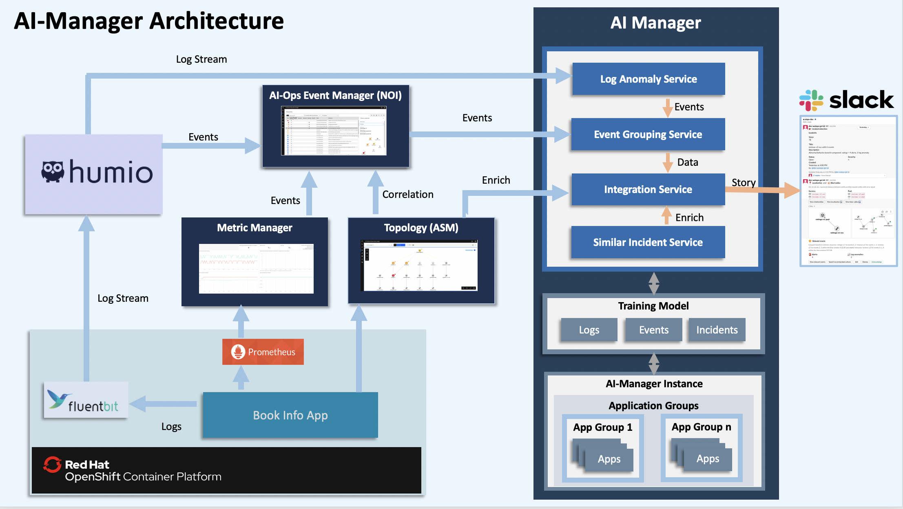

Note: Humio is used in the architecture. But you can use LogDNA as well.

Here is teh overall steps to be done for Log Anomaly detection. As part of this article, we will do the checked steps.

- [X] 1. Integrate Slack at AI-Manager Instance level
- [X] 2. Create Application Group
- [X] 3. Integrate ASM at App Group level
- [X] 4. Create Application (bookinfo)
- [ ] 5. Train Log Anomaly Models (LogDNA)
- [x] 6. Integrate LogDNA at app level
- [ ] 7. Introduce Log Anomaly at BookInfo app
- [ ] 8. View new Incident in a slack story

Here is the picture about overall steps.


----

## 1. AI-Manager Instance

Open AI-Manager console.

Click on the `View All` to see the AI-manager instances.

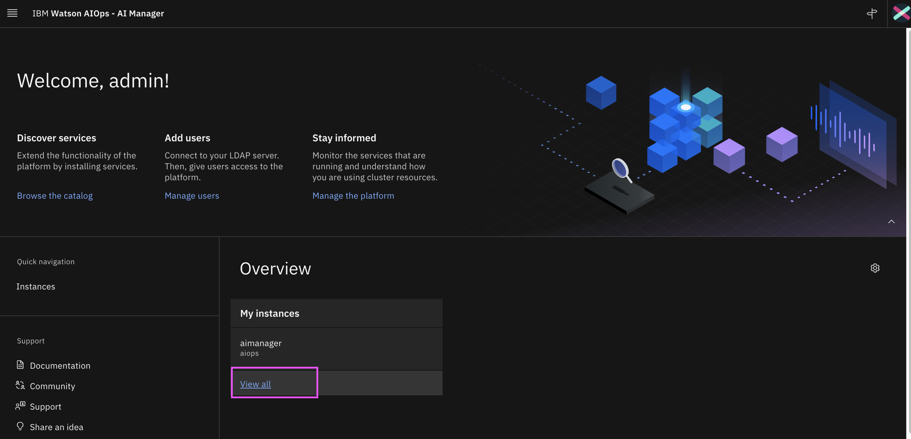


The below picture shows the AI-Manager instances list. Here there is one entry found with the name `aimanager`. This was installed by default when the AI-Manager was installed.

Click on the `Open` link to see details of the instance.

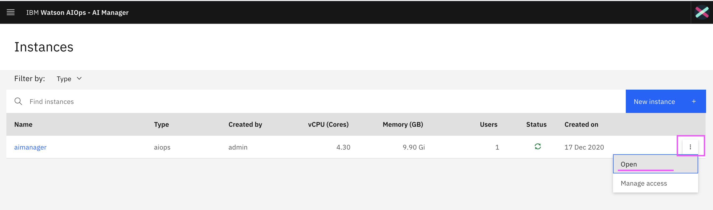

At AI-Manager instane level the following can be configured.

* Application Groups
* Ops Integration (Slack, ServiceNow)

### 1.1 Application Groups at AI-Manager Instance Level

We can create Application groups at this level. The below picture shows list of Application groups available in the `aimanager` instance.

There is a group called `Financial Apps` already created and listed here.

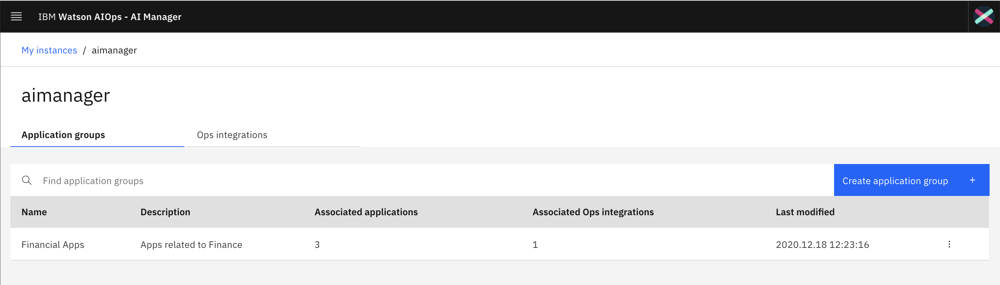

### 1.2 Ops Integrations at AI-Manager Instance Level

The below picture shows the Ops Integration where `slack` is being already integrated.

Click on the `...` link to see details of the `slack` integration.

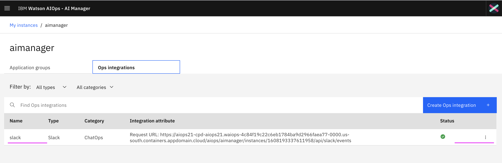

#### 1.2.1 Slack configuration

The below picture shows the `slack` configuration details.

You should have already created a `slack` channel and those details to be furnished here.

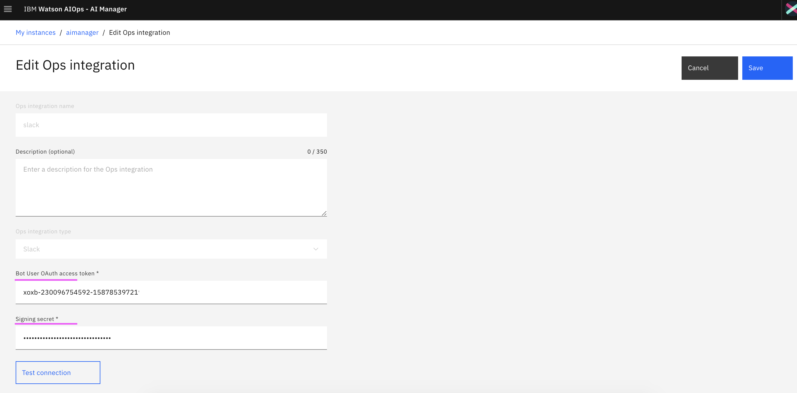

----

## 2. Application Group 

At Application Group  level the following can be configured.

* Applications
* Ops Integration (ASM Toplogy)

### 2.1 Application Group Configuration

#### Select a group

Click on the `...` link to see details of the `Financial Apps` group.

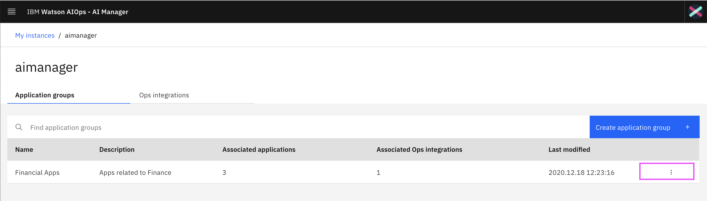

#### Edit

Here is the configuration of the Group. 

You need to enter slack channel id in the `Platform Channel ID`.

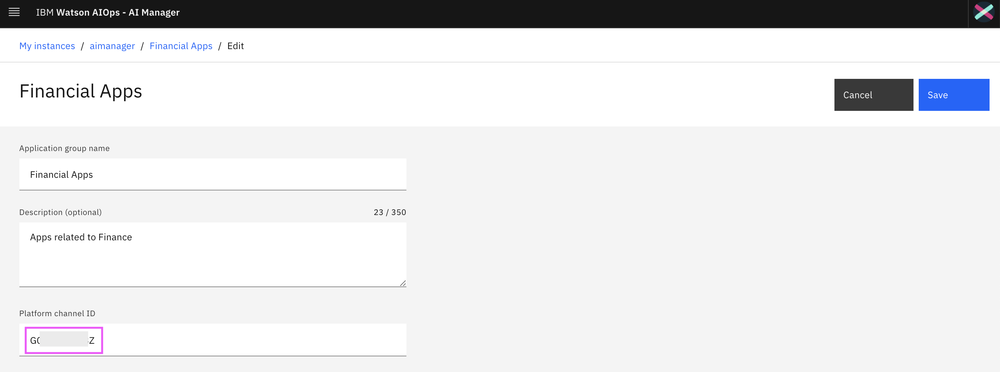

#### Create

The create group screens looks like the below.

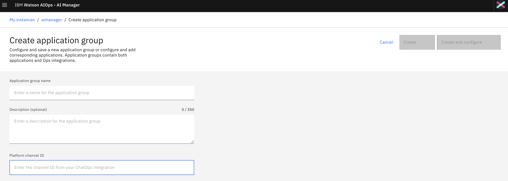


### 2.2 Ops Integration at Application Group Level

The below picture shows that the `Financial Apps` group is integrated with `ASM`.

Click on the `...` link to see details of the `ASM` integration.


#### 2.2.1 ASM (Netcool Agile Service Manager) Configuration

Here is the configuration of the `ASM`


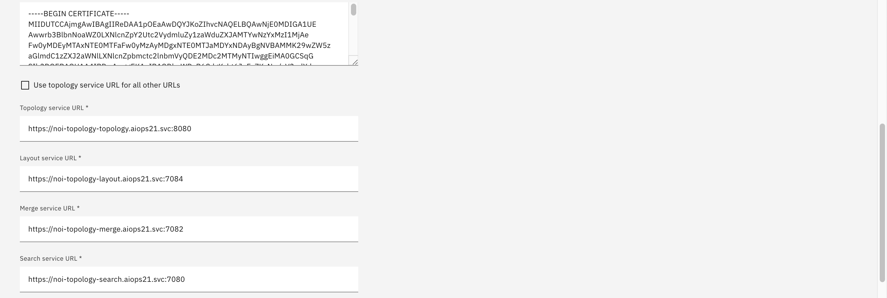
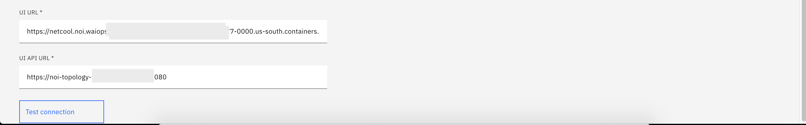

#### a) User ID and Password

Search for `secret` contains name `topology-asm-credentials`

You can find the username and password from there.

Ex: 

username : noi-topology-aiops21-user
password: 


#### b) URLs

The below ULRs to be given.

```
Topology URL : https://NOI_INSTANCE_NAME-topology-topology.NAMESPACE.svc:8080
Layout URL : https://NOI_INSTANCE_NAME-topology-layout.NAMESPACE.svc:7084
Merge Service URL : https://NOI_INSTANCE_NAME-topology-merge.NAMESPACE.svc:7082
Search URL : https://NOI_INSTANCE_NAME-topology-search.NAMESPACE.svc:7080
UI URL : https://NOI_INSTANCE_NAME.AI_MANAGER_INSTANCE_NAME.CLUSTER_URL
UI API URL : https://NOI_INSTANCE_NAME-topology-ui-api.NAMESPACE.svc:3080
```

Here

NAMESPACE --> namespace where ai-ops installed (aiops)
NOI_INSTANCE_NAME --> noi instance id (noi)
AI_MANAGER_INSTANCE_NAME --> ai-manager instance id (aimanager)
CLUSTER_URL -->  cluster URL (abcd.us-south.containers.appdomain.cloud)


Ex:

```
Topology URL : https://noi-topology-topology.aiops.svc:8080
Layout URL : https://noi-topology-layout.aiops.svc:7084
Merge Service URL : https://noi-topology-merge.aiops.svc:7082
Search URL : https://noi-topology-search.aiops.svc:7080
UI URL : https://noi.aimanager.abcd.us-south.containers.appdomain.cloud
UI API URL : https://noi-topology-ui-api.aiops.svc:3080
```


#### c) Certificate

1. Get into a shell of the pod that contains the name `topology-topology`

```bash
 oc exec -it $(oc get po| grep topology-topology |awk '{print $1}') bash
```

2. Run the below command to print the certificate.

```bash
cat \{CA_CERTIFICATE_NAME\}-00
```

Copy the certificate and use it 


### 2.3 Application at Application Group Level

The below picture shows list of applications installed under the `Financial Apps` group.

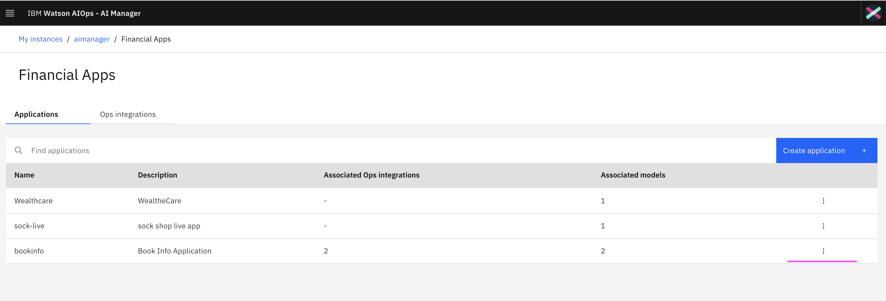

----

## 3. Applications

At Application level the following can be configured.

* Ops Integration (LogDNA, Humio, PagerDuty, NOI-Events, ELK, Splunk)
* Insight Models (Logs/incidents/events training)

From the above picture, click on the `bookinfo` app to see details of that.

### 3.1 Ops Integration at Application level

At App level integration can be done with below tools.

```
KAFKA
LogDNA
Humio
ELK
PagerDuty
Splunk
Custom
```

In most of the cases, atleast 2 integrations are configured per app.

- NOI-Events using `Kafka`
- Logs using `LogDNA` or `Humio`

#### 3.1.1 Integration with LogDNA and Kafka

The below picture shows that the application is integrated with `LogDNA`  and   `Kafka`.

You can click  on `...` link to see details of the `LogDNA`  and `Kafka`.

**Note:** You can do this step only after training the logs.

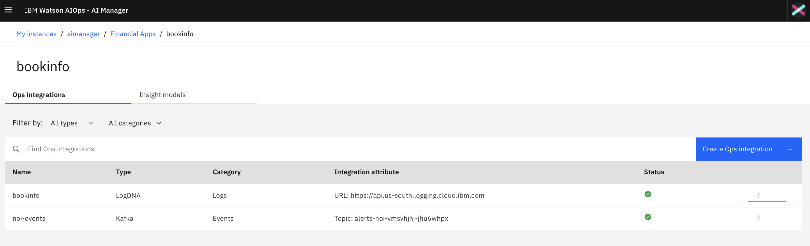

#### 3.1.1.1 LogDNA

1. The below picture shows the `LogDNA` configuration.

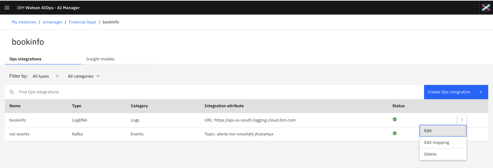
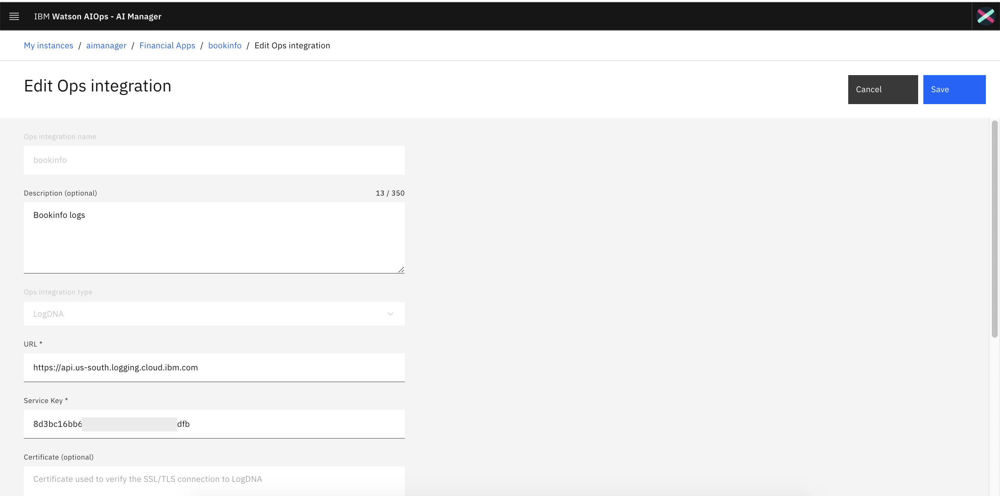
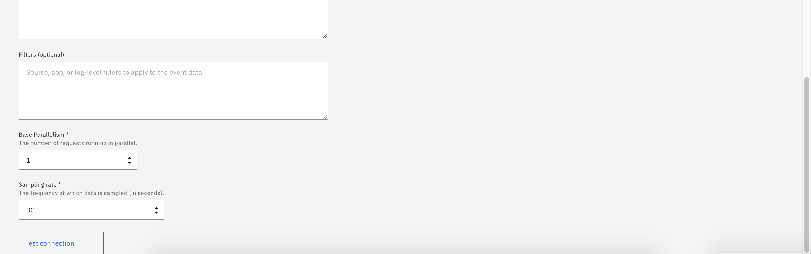

2. You can get the LogDNA Service Key from the below location in the logdna UI.

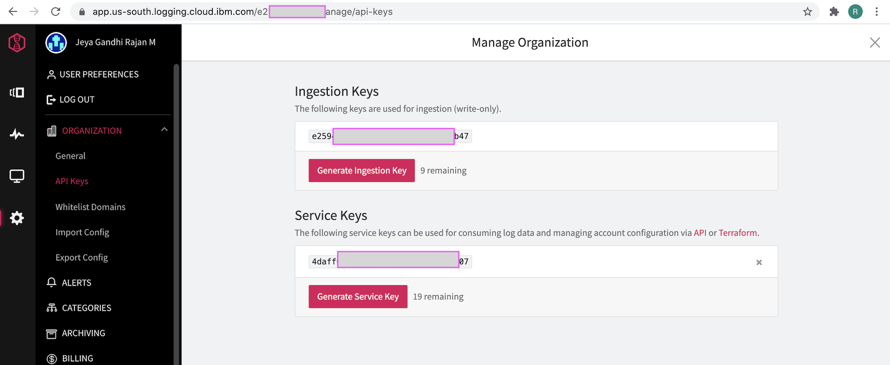

3. You may need to update the Mapping as well.

```json
{
    "codec": "logdna",
    "message_field": "_line",
    "log_entity_types": "pod,_cluster,container",
    "instance_id_field": "_app",
    "rolling_time": 10,
    "timestamp_field": "_ts"
}
```

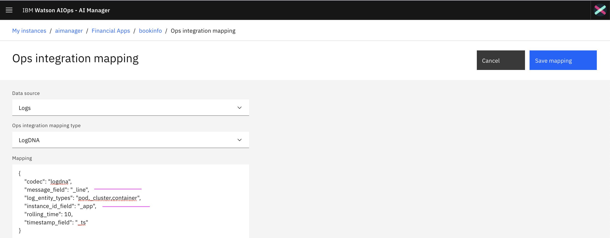


#### 3.1.1.2 Kafka (NOI-Events)

The below picture shows the `NOI-Events` configuration.

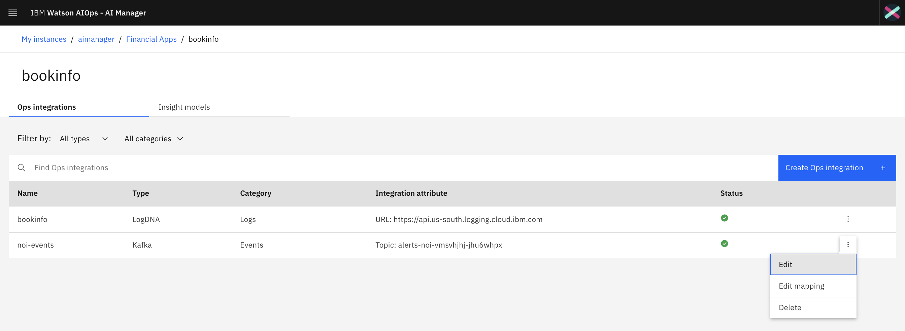
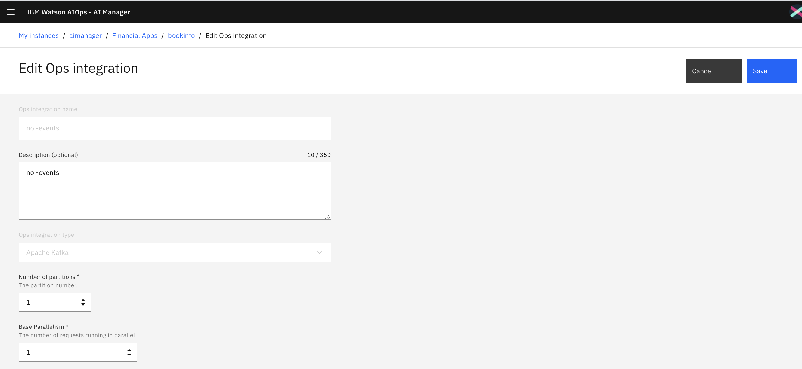

----

#### 3.1.2 Integration with Humio and Kafka

The below picture shows that the application is integrated with `Humio`  and   `Kafka`.

You can click  on `...` link to see details of the `Humio`  and `Kafka`.

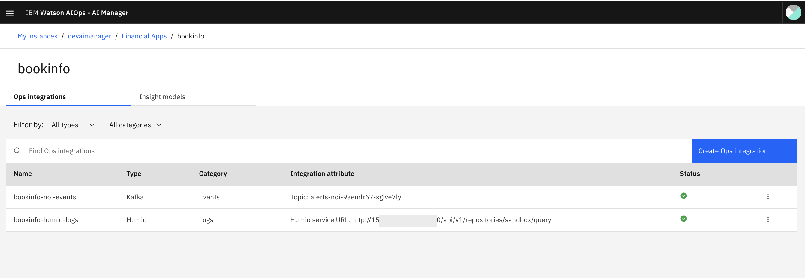

#### Humio

1. The below picture shows the `Humio` configuration.

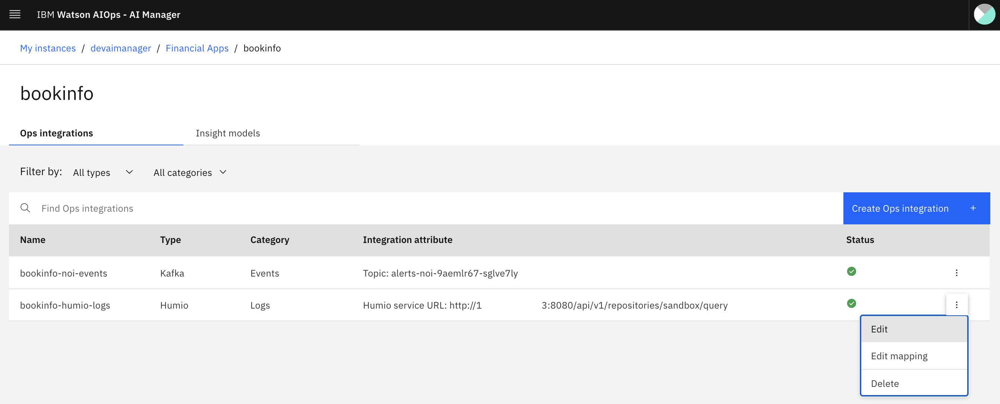
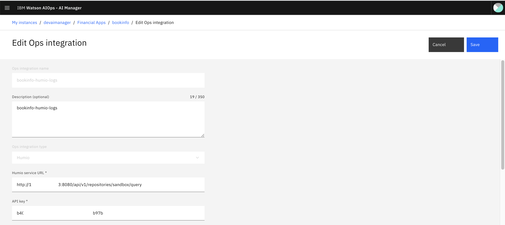
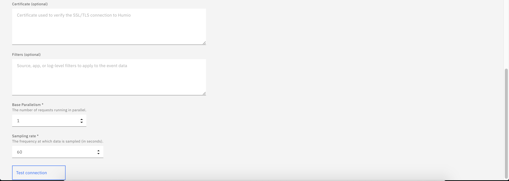

2. You can get the Humio Service Key from the below location in the Humio UI.

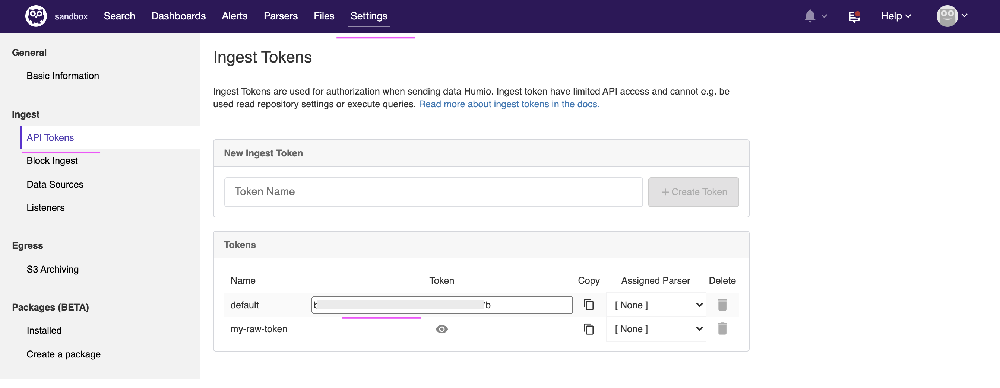

3. You may need to update the Mapping as well.

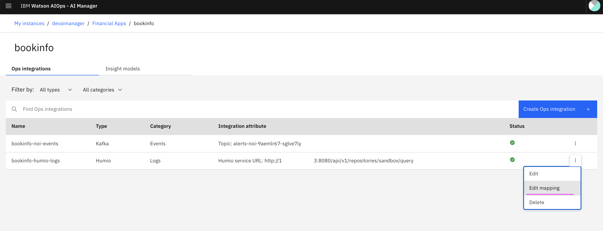


```
{
    "codec": "humio",
    "message_field": "@rawstring",
    "log_entity_types": "clusterName, kubernetes.container_image_id, kubernetes.host, kubernetes.container_name, kubernetes.pod_name",
    "instance_id_field": "kubernetes.container_name",
    "rolling_time": 10,
    "timestamp_field": "@timestamp"
}
```
----

#### 3.1.3 Other Integrations options to the app

The below picture shows `create ops integration` screen with other integration options such as `Humio`, `ELK` and etc.

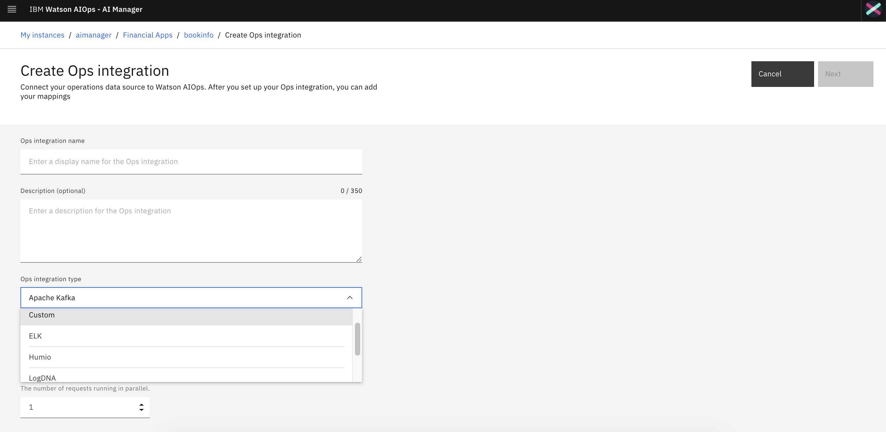

----

### 3.2 Insight Models

The below picture shows the `Insight Models` configured for the application.

You can train the logs, incidents, events and etc.

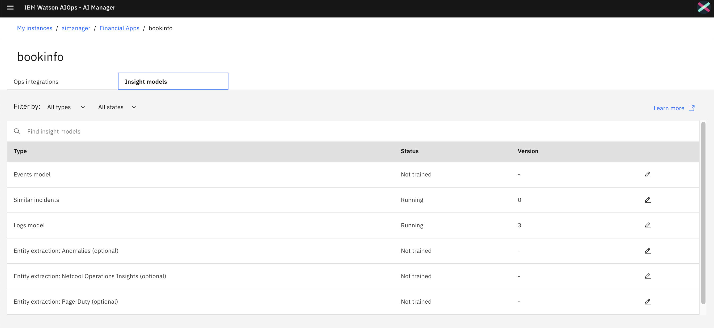