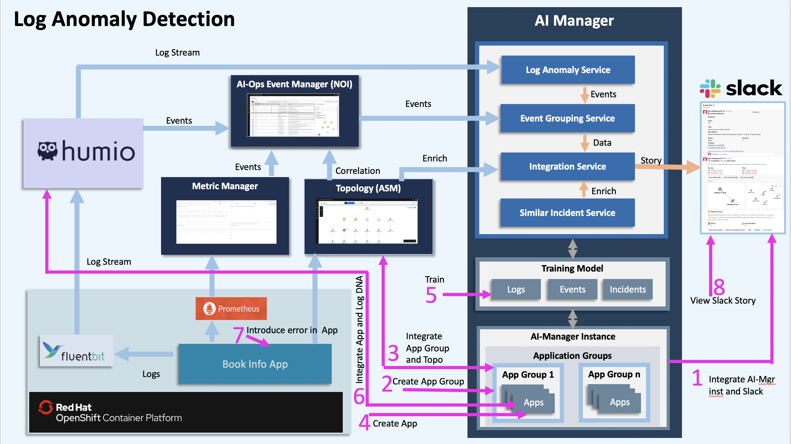
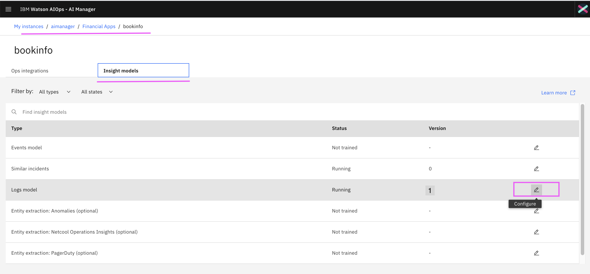
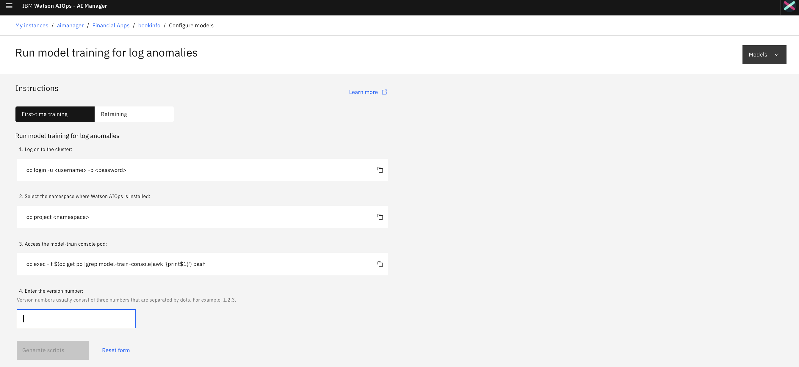
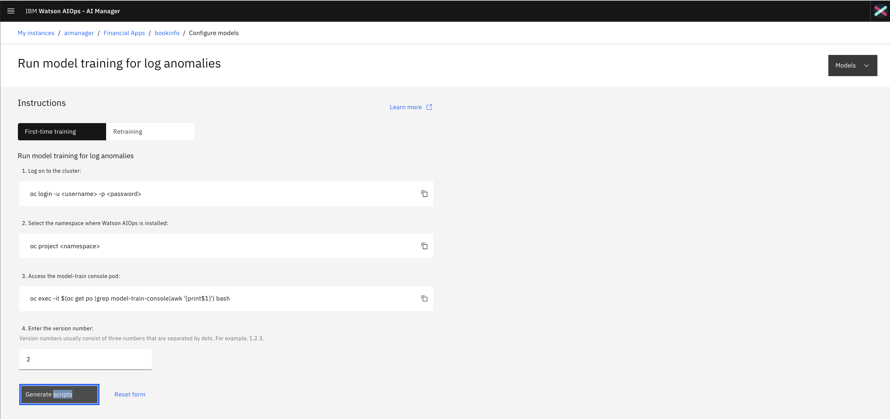
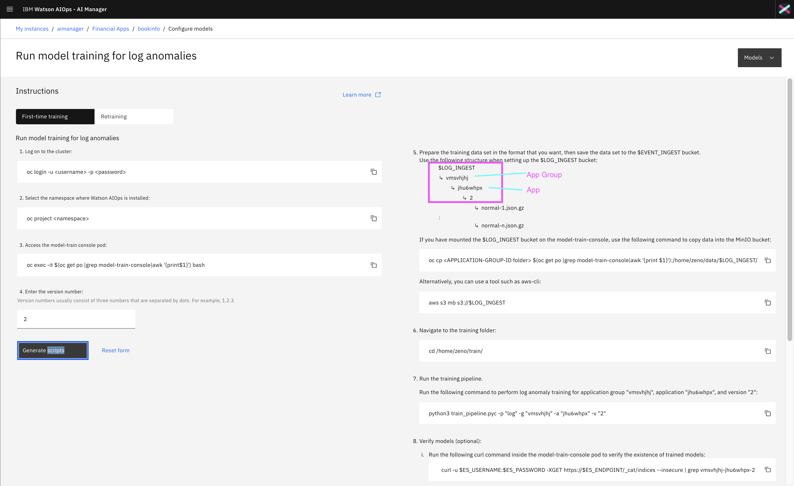

# Training Log anomaly models for AI Manager in Watson AI-Ops

This article explains about how to train normal logs from LogDNA/Humio and create log anomaly models for AI Manager in Watson AI-Ops.

The article is based on the the following
 - RedHat OpenShift 4.5 on IBM Cloud (ROKS)
 - Watson AIOps 2.1

## Overview

Here is the architecture and flow of  Watson AI-Ops.


Note: Humio is used in the architecture. But you can use LogDNA as well.

Here is the overall steps to be done for Log Anomaly detection. As part of this article, we will do the checked steps.

- [ ] 1. Integrate Slack at AI-Manager Instance level
- [ ] 2. Create Application Group
- [ ] 3. Integrate ASM at App Group level
- [ ] 4. Create Application (bookinfo)
- [x] 5. Train Log Anomaly Models (LogDNA)
- [ ] 6. Integrate LogDNA at app level
- [ ] 7. Introduce Log Anomaly at BookInfo app
- [ ] 8. View new Incident in a slack story


Here is the picture about overall steps.



## 1. Download logs from LogDNA / Humio

Download normal logs (logs without error) from LogDNA / Humio. 

The content of the file would be looking like [this](files/normal-1.json). 

Refer the below articles to know how to download logs.


## 2. Generate Training Scripts

1. Open the `bookinfo` app from the `aimanager` instance.

2. Select the `Insight Models` tab.

3. Click on the `edit` icon of the `Logs Model` item.



### Give version number for the training

For first time training, enter `1` as a version number, otherwise, give next version. 



Here in this case, we are giving verion number as `2`.  Click on `Generate Scripts`



### Generate Training scripts

Here is the training script generated. You can use this info for training. Here `Application Group Id` and `Application Id` can be noted.




## 3. Training

### 3.1 Prepare Normal Logs

Let us assume, we have already trained the normal logs version `1`. For the next time training here the version should be  `2`.

#### Rename log file

Rename the log file into `normal-2.json` as we train for 2nd time.

For the first time, the log file name should be `normal-1.json`

#### gzip log file

gzip the log file by running the below command

```
  gzip normal-2.json
```

You will get `normal-2.json.gz` file.

#### Move the log file under version number folder

Create a folder with the version number. And copy the log file side by running the below command.

```
  mkdir 2
  cp normal-2.json.gz 2
```

### 3.2 Get into training POD

#### Login to Cluster

```
oc login --token=YYYYYYYYYYYYYYYYYY --server=https://a111-e.us-south.containers.cloud.ibm.com:11111
```

#### Switch Namespace

Switch to namespace where AI Manager is installed.

Ex: 
```
oc project aiops21
```

#### Get into training POD

Get into the `model-train-console` POD

```
 oc exec -it $(oc get po |grep model-train-console|awk '{print $1}') bash
```

### 3.3 Create Directory Structure

It is required to create Directory Structure in the training POD. The directory structure contains  `log-ingest` , `Application Group Id` and `Application Id` directories.

Run the below command.

```
 mkdir -p /home/zeno/data/log-ingest/vmsvhjhj/uj0r4jom
```

Here 

`vmsvhjhj` is `Application Group Id`

`uj0r4jom` is `Application Id`


### 3.4 Copy Logs  from local system to training pod

#### Open New Terminal Window

Open another Terminal Window

#### Copy Normal logs to Training POD

1. Goto the folder `2` where we have stored the normal logs.

2. Run the below command to copy the file to training pod.

```
oc cp 2 $(oc get po |grep model-train-console|awk '{print $1}'):/home/zeno/data/log-ingest/vmsvhjhj/uj0r4jom
```

#### Back to the Training POD shell

Go back to the previous terminal window, where we had the training POD shell.

### 3.5 Copy logs from Training POD to s3 bucket

#### Create S3 bucket from Training POD

Create S3 buckets by doing the below step. It will create, if it is not exists.

```
  aws s3 mb s3://log-ingest
```

#### Copy log data from Training POD to s3 bucket

Run the below command, to copy to s3 bucket

```
aws s3 cp /home/zeno/data/log-ingest s3://log-ingest/ --recursive
```

The output would be something like the below.

```
upload: log-ingest/vmsvhjhj/uj0r4jom/2/normal-2.json.gz to s3://log-ingest/vmsvhjhj/uj0r4jom/2/normal-2.json.gz
```

### 3.6 Update S3 Datastore

This is one time process.

Need to modify the `mount_cos` datastore into `s3_datastore` in the training pod.

Refer this article : abcd.com

### 3.7 Update Mapping file

This is one time process. 

This step can be skipped for LogDNA as it is a default one.

Need to create `groupid-appid-ingest_conf.json` in the training pod for humio/elk/splunk logs. The template is already given below.

```
/home/zeno/train/ingest_configs/log/groupid-appid-ingest_conf.json.elk_example
/home/zeno/train/ingest_configs/log/groupid-appid-ingest_conf.json.humio_example
/home/zeno/train/ingest_configs/log/groupid-appid-ingest_conf.json.splunk_example
```

For creating mapping file for humio you can run the below command. 

```
cd /home/zeno/train/ingest_configs/log
cp groupid-appid-ingest_conf.json.humio_example vmsvhjhj-uj0r4jom-ingest_conf.json
```

Here 

`vmsvhjhj` is `Application Group Id`

`uj0r4jom` is `Application Id`

### 3.8 Run training

#### Run 

Run the below command to start the training.

```
cd /home/zeno/train
python3 train_pipeline.pyc -p "log" -g "vmsvhjhj" -a "uj0r4jom" -v "2"
```

#### Output

The output could be the following.

```
Launching Jobs for: Log Ingest Training
	prepare training environment

	training_ids:
		1: ['training-YJGzTF-MR']
	jobs ids are saved here: JOBS/vmsvhjhj/uj0r4jom/2/log_ingest.json

.............
.............
.............

```

#### Verify trained model

Run the following curl command inside the model-train-console pod to verify the existence of trained models:


```
curl -u $ES_USERNAME:$ES_PASSWORD -XGET https://$ES_ENDPOINT/_cat/indices  --insecure | grep vmsvhjhj-uj0r4jom-2
```

Note: There should be four models in Elasticsearch (applications, pca_model, pca_fe, and templates).


#### Error during training

When there is an error during the training and you want to delete the training entry, then you can do that using DLaaS.

Refer this article : abcd.com

## Quick Reference

```
oc project devaiops
cd /Users/jeyagandhi/Gandhi/01-Tasks/049-AI-Ops/Work/20210202-wealthcare-dev/humio/logs
oc cp 1 $(oc get po |grep model-train-console|awk '{print $1}'):/home/zeno/data/log-ingest/w0vpv1gi/za4xk6hg

oc exec -it $(oc get po |grep model-train-console|awk '{print$1}') bash

aws s3 ls s3://log-ingest/w0vpv1gi/za4xk6hg/
aws s3 cp /home/zeno/data/log-ingest/  s3://log-ingest/ --recursive
aws s3 rm s3://log-ingest/w0vpv1gi/za4xk6hg/1/.DS_Store

cd /home/zeno/train
python3 train_pipeline.pyc -p "log" -g "w0vpv1gi" -a "za4xk6hg" -v "1"

Verify trained model:
curl -u $ES_USERNAME:$ES_PASSWORD -XGET https://$ES_ENDPOINT/_cat/indices  --insecure | grep w0vpv1gi-za4xk6hg-1

Note: There should be four models in Elasticsearch (applications, pca_model, pca_fe, and templates).

```
