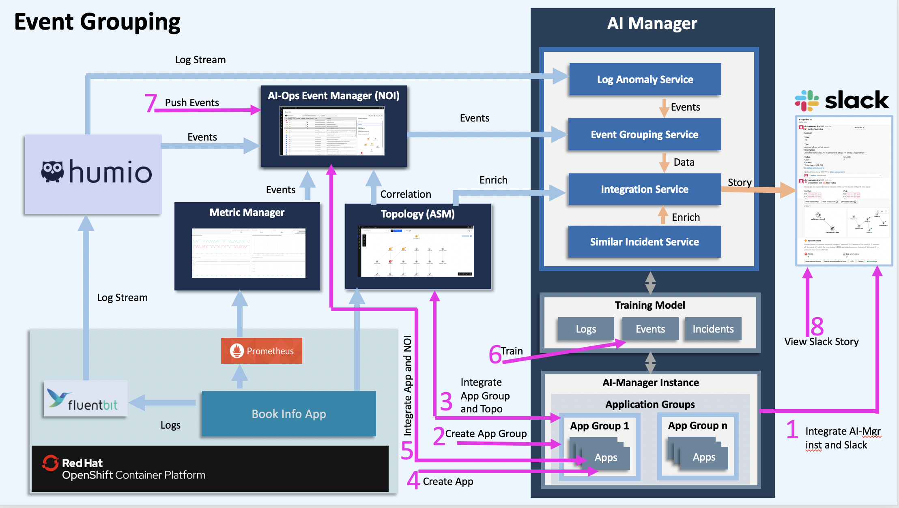
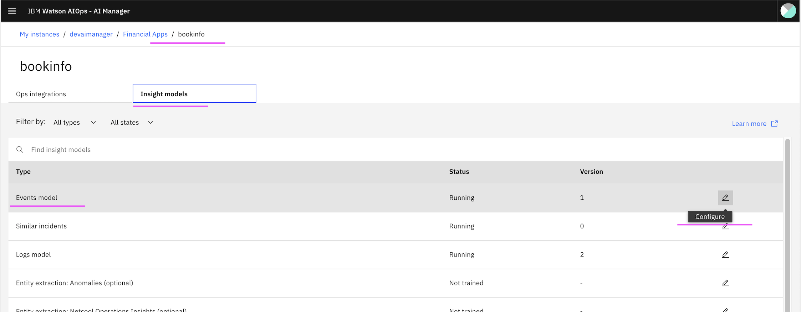
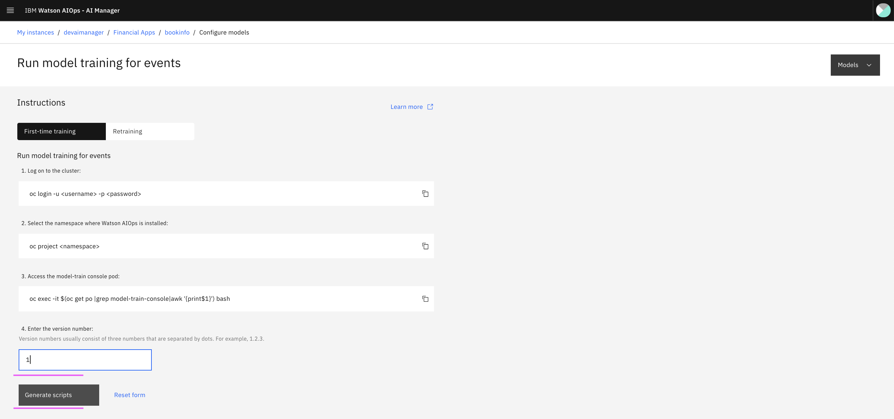
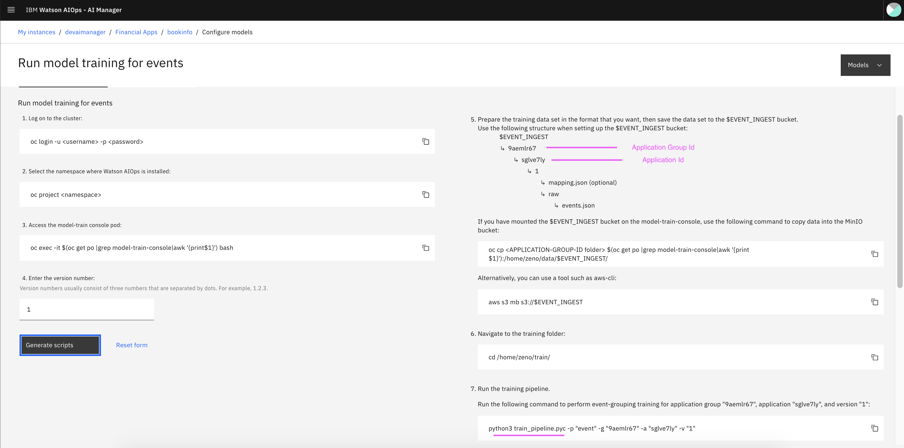
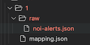
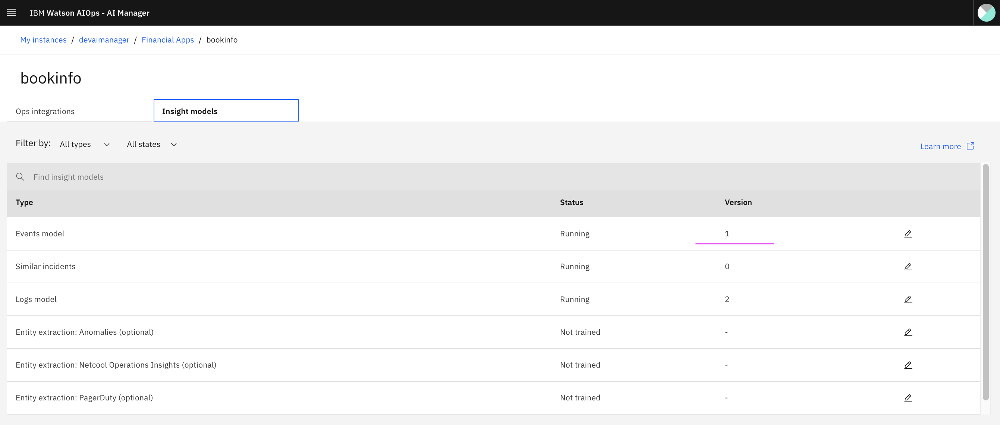

# Training Events for AI Manager in Watson AIOps

This article explains about how to train NOI events (IBM Netcool Operations Insights) from Event Manager and create event models for AI Manager in Watson AIOps.

The article is based on the the following
 - RedHat OpenShift 4.5 on IBM Cloud (ROKS)
 - Watson AIOps 2.1

## Overview

Here is the architecture and flow of  Watson AI-Ops.


Note: Humio is used in the architecture. But you can use LogDNA as well.

Here is the overall steps to be done for Event Grouping. As part of this article, we will do the checked step only.

- [ ] 1. Integrate Slack at AI-Manager Instance level
- [ ] 2. Create Application Group
- [ ] 3. Integrate Topology Manager (ASM) at App Group level
- [ ] 4. Create Application (bookinfo)
- [ ] 5. Integrate NOI at app level
- [x] 6. Train NOI-Events
- [ ] 7. Push Events
- [ ] 8. View new Incident in a slack story

**Note:** The steps `1, 2, 3, 4 and 5` to be done as a pre-requsite. You can do that by using the article 
https://community.ibm.com/community/user/middleware/blogs/jeya-gandhi-rajan-m1/2021/02/09/configuring-ai-manager-in-watson-ai-ops


Here is the picture about overall steps.



## 1. Generate Training Scripts

1. Open the `bookinfo` app from the `aimanager` instance.

2. Select the `Insight Models` tab.

3. Click on the `edit` icon of the `Events Model` item.



### Give version number for the training

For the first time training, enter `1` as a version number, otherwise, give the next version. 



Here in this case, we are giving verion number as `1`.  

Click on `Generate Scripts`

### Generate Training scripts

Here is the training script generated. You can use this info for the training. Here `Application Group Id` and `Application Id` can be noted.




## 3. Training

### 3.1 Prepare Events Data

Let us assume that we are training the events for first time, so the version no. is `1`. If we train for second time then it is `2` and so on.

#### Folder structure

The folder structure looks like this.




#### Create folder structure

Create a folder with the version number `1` and create `raw` folder there.

``` bash
  mkdir -p 1/raw
```

#### Copy NOI-Events file

The sample events data file is available here [noi-alerts.json](./files/1/raw/noi-alerts.json) for your reference.

Copy your events data for training into `raw` folder.

Ex: 

``` bash
  cp /files/1/raw/noi-alerts.json 1/raw
```

#### Copy Mapping file

The NOI-events mapping file is available here [mapping.json](./files/1/mapping.json) for your reference.

```json
{
  "mapping": {
    "codec": "noi",
    "instance_id_field": "alert.source.source_alert_id",
    "log_entity_types": "pod,_cluster,container",
    "message_field": "alert.title",
    "timestamp_field": "timestamp",
    "alert_max_file_size_mb": 100
  }
}
```

Copy this mapping file for training into `1` folder.

Ex: 

``` bash
  cp /files/1/mapping.json 1
```

### 3.2 Get into training POD


#### Login to Cluster

```
oc login --token=YYYYYYYYYYYYYYYYYY --server=https://a111-e.us-south.containers.cloud.ibm.com:11111
```

#### Switch Namespace

Switch to namespace where AI Manager is installed.

Ex: 
```bash
oc project aiops21
```

#### Get into trainng POD

Get into the `model-train-console` POD

```
 oc exec -it $(oc get po |grep model-train-console|awk '{print $1}') bash
```

### 3.3 Create Directory Structure in the training pod

It is required to create Directory Structure in the training POD. The directory structure contains  `event-ingest` , `Application Group Id` and `Application Id` directories.

Run the below command.

```
 mkdir -p /home/zeno/data/event-ingest/9aemlr67/sglve7ly
```

Here 

`9aemlr67` is `Application Group Id`

`sglve7ly` is `Application Id`


### 3.4 Copy Events Data from local system to training pod

#### Open New Terminal Window

Open another Terminal Window

#### Copy the prepared events data to Training POD

1. Goto the parent folder of `1` where we have stored the events data.

2. Run the below command to copy the file to training pod.

```
oc cp 1 $(oc get po |grep model-train-console|awk '{print $1}'):/home/zeno/data/event-ingest/9aemlr67/sglve7ly
```

#### Back to the Training POD shell

Go back to the previous terminal window, where we had the training POD shell.

### 3.5 Copy events data from Training POD to s3 bucket

#### Create S3 bucket from Training POD

Create S3 buckets by doing the below step. It will create, if it is not exists.

```
  aws s3 mb s3://event-ingest
```

#### Copy events data from Training POD to s3 bucket

Run the below command, to copy to s3 bucket

```
aws s3 cp /home/zeno/data/event-ingest s3://event-ingest/ --recursive
```

The output would be something like the below.

```
upload: event-ingest/9aemlr67/sglve7ly/1/mapping.json to s3://event-ingest/9aemlr67/sglve7ly/1/mapping.json
upload: event-ingest/9aemlr67/sglve7ly/1/raw/noi-alerts.json to s3://event-ingest/9aemlr67/sglve7ly/1/raw/noi-alerts.json
```

### 3.6 Update S3 Datastore

This is one time process.

Need to modify the `mount_cos` datastore into `s3_datastore` in the training pod.

Refer this article : abcd.com

### 3.7 Update Mapping file

This is one time process. 

Need to create `groupid-appid-ingest_conf.json` in the training pod. The template is already given below.

```
/home/zeno/train/ingest_configs/event/groupid-appid-ingest_conf.json.example
```

For creating mapping file you can run the below command. 

```
cd /home/zeno/train/ingest_configs/event
cp groupid-appid-ingest_conf.json.example 9aemlr67-sglve7ly-ingest_conf.json
```

Here 

`9aemlr67` is `Application Group Id`

`sglve7ly` is `Application Id`


### 3.8 Run training

#### Run 

Run the below command to start the training.

```
cd /home/zeno/train
python3 train_pipeline.pyc -p "event" -g "9aemlr67" -a "sglve7ly" -v "1"
```

#### Output

The output could be the following.

``` log
<user1>$ python3 train_pipeline.pyc -p "event" -g "9aemlr67" -a "sglve7ly" -v "1"


Launching Jobs for: Event Ingest Training
	prepare training environment
	event-group not present
	bucket created: event-group

	training_ids:
		1: ['training-bQv-MlPMg']
	jobs ids are saved here: JOBS/9aemlr67/sglve7ly/1/event_ingest.json


	Training... |████████████████████████████████| [0:04:20], complete: 1/1 {'COMPLETED': 1}

	Job-ids ['training-bQv-MlPMg'] are COMPLETED
	Please check the logs of COMPLETED jobs here: s3://event-group


Launching Jobs for: Event Grouping Training
	prepare training environment
	event-grouping-service not present
	bucket created: event-grouping-service

	training_ids:
		1: ['training-vRduG_PMR']
	jobs ids are saved here: JOBS/9aemlr67/sglve7ly/1/event_group.json


	Training... |████████████████████████████████| [0:03:20], complete: 1/1 {'COMPLETED': 1}

	Job-ids ['training-vRduG_PMR'] are COMPLETED
	Please check the logs of COMPLETED jobs here: s3://event-grouping-service

	moving trained models
		event-grouping-service/training-vRduG_PMR/9aemlr67/sglve7ly --> event-grouping-service/9aemlr67/sglve7ly

Deploying the event pipeline automatically
	update the model_latest.json file
	updating elastic search database (for front-end only)

Deploying the mapping pipeline automatically
	update the model_latest.json file
	updating elastic search database (for front-end only)

```


#### Result

After the training you can see the version number appearing in the UI.




#### Error during training


When there is an error during the training and you want to delete the training entry, then you can do that using DLaaS.

Refer this article : abcd.com


## Quick Reference

You have already prepared your training data.

#### Goto Training POD

``` bash
export NAMESPACE=aiops21

oc project $NAMESPACE
oc exec -it $(oc get po |grep model-train-console|awk '{print$1}') bash
```

#### Create directory structure in training pod and mapping file copy

``` bash
export APP_GROUP_ID=9aemlr67
export APP_ID=sglve7ly
export VERSION_NO=1

mkdir -p /home/zeno/data/event-ingest/$APP_GROUP_ID/$APP_ID


cd /home/zeno/train/ingest_configs/event
cp groupid-appid-ingest_conf.json.example $APP_GROUP_ID-$APP_ID-ingest_conf.json

```

#### Copy data from local system to training pod

``` bash
export APP_GROUP_ID=9aemlr67
export APP_ID=sglve7ly
export VERSION_NO=1

oc cp $VERSION_NO $(oc get po |grep model-train-console|awk '{print $1}'):/home/zeno/data/event-ingest/$APP_GROUP_ID/$APP_ID
```

#### Copy the files to bucket and start the Training in training pod

``` bash
export APP_GROUP_ID=9aemlr67
export APP_ID=sglve7ly
export VERSION_NO=1

aws s3 mb s3://event-ingest
aws s3 cp /home/zeno/data/event-ingest/  s3://event-ingest/ --recursive
cd /home/zeno/train
python3 train_pipeline.pyc -p "event" -g "$APP_GROUP_ID" -a "$APP_ID" -v "$VERSION_NO"
```
