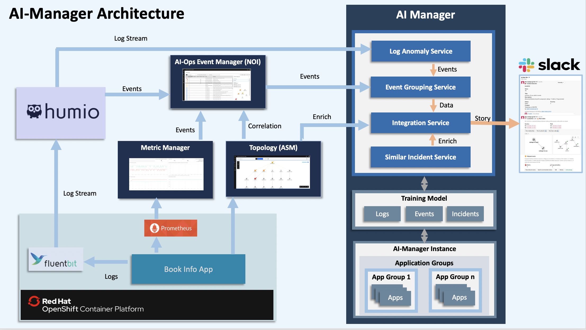

# Training Simlar Incidents for AI Manager in Watson AIOps

This article explains about how to train Similar Incidents and create incidents models for AI Manager in Watson AIOps.

The article is based on the the following
 - RedHat OpenShift 4.5 on IBM Cloud (ROKS)
 - Watson AIOps 2.1

## Overview

Here is the architecture and flow of  Watson AI-Ops.



Note: Humio is used in the architecture. But you can use LogDNA as well.

Here is the overall steps to be done for Similar Incidents. As part of this article, we will do the checked steps.

- [X] 1. Integrate Slack at AI-Manager Instance level
- [X] 2. Create Application Group
- [X] 3. Integrate Topology Manager (ASM) at App Group level
- [X] 4. Create Application (bookinfo)
- [X] 5. Train Log Anomaly Models (LogDNA)
- [X] 6. Train Incidents
- [X] 7. Integrate LogDNA at app level
- [X] 8. Integrate NOI at app level
- [ ] 9. Introduce Log Anomaly at BookInfo app
- [ ] 10. View new Incident in a slack story

**Note:** 

The steps `1 to 6` to be done as a pre-requsite. 

Do the steps `1 to 4` using this article
https://community.ibm.com/community/user/middleware/blogs/jeya-gandhi-rajan-m1/2021/02/09/configuring-ai-manager-in-watson-ai-ops

Do the steps `4` using this article
https://community.ibm.com/community/user/middleware/blogs/jeya-gandhi-rajan-m1/2021/02/10/training-log-anomaly-models-for-ai-manager


Here is the picture about overall steps.


## 1. Generate Training Scripts

1. Open the `bookinfo` app from the `aimanager` instance.

2. Select the `Insight Models` tab.

3. Click on the `edit` icon of the `Similar Incidents Model` item.


### Give incident file location for the training

Enter some value like `s3://bucket/file.tar` in the `Historical incident file location on MinIO` text box.

Click on `Generate Scripts`


### Generate Training scripts

Here is the training script generated. You can use this info for the training. Here `Application Group Id` and `Application Id` can be noted.


Here 

`9aemlr67` is `Application Group Id`

`sglve7ly` is `Application Id`


## 3. Training

### 3.1 Prepare Incidents Data

The sample Incidents data file is available here [incidents_bookinfo.json](./files/incidents_bookinfo.json) for your reference.


### 3.2 Get into training POD


#### Login to Cluster

```
oc login --token=YYYYYYYYYYYYYYYYYY --server=https://a111-e.us-south.containers.cloud.ibm.com:11111
```

#### Switch Namespace

Switch to namespace where AI Manager is installed.

Ex: 
```bash
oc project aiops21
```

#### Get into trainng POD

Get into the `model-train-console` POD

```
 oc exec -it $(oc get po |grep model-train-console|awk '{print $1}') bash
```

### 3.3 Create Directory Structure in the training pod

It is required to create Directory Structure in the training POD. The directory structure contains  `incident-ingest` , `Application Group Id` and `Application Id` directories.

Run the below command.
```
 mkdir -p /home/zeno/data/incident-ingest/9aemlr67/sglve7ly
```

Here 

`9aemlr67` is `Application Group Id`

`sglve7ly` is `Application Id`


### 3.4 Copy incidents Data from local system to training pod

#### Open New Terminal Window

Open another Terminal Window

#### Copy the prepared incidents data to Training POD

Run the below command to copy the file to training pod.

```
oc cp ./files/incidents_bookinfo.json $(oc get po |grep model-train-console|awk '{print $1}'):/home/zeno/data/incident-ingest/9aemlr67/sglve7ly/incidents_bookinfo.json

```

#### Back to the Training POD shell

Go back to the previous terminal window, where we had the training POD shell.

### 3.5 Copy incidents data from Training POD to s3 bucket

#### Create S3 bucket from Training POD

Create S3 buckets by doing the below step. It will create, if it is not exists.

```
  aws s3 mb s3://$SIMILAR_INCIDENTS
```

#### Copy incidents data from Training POD to s3 bucket

Run the below command, to copy to s3 bucket

```
aws s3 cp /home/zeno/data/incident-ingest s3://$SIMILAR_INCIDENTS/ --recursive
```

The output would be something like the below.

```
upload: incident-ingest/9aemlr67/sglve7ly/incidents_bookinfo.json to s3://similar-incident-service/9aemlr67/sglve7ly/incidents_bookinfo.json
```

### 3.6 Update S3 Datastore

This is one time process.

Need to modify the `mount_cos` datastore into `s3_datastore` in the training pod.

Refer this article : abcd.com

### 3.7 Run training

#### Run 

Run the below command to start the training.

```
cp /home/zeno/train/deploy_model.pyc /home/zeno/train/deploy_model.py
cd /home/zeno/incident/
bash index_incidents.sh s3://similar-incident-service/9aemlr67/sglve7ly/incidents_bookinfo.json 9aemlr67 sglve7ly
```


#### Error during training

When there is an error during the training and you want to delete the training entry, then you can do that using DLaaS.

Refer this article : abcd.com


## Quick Reference

You have already prepared your training data.

#### Goto Training POD

``` bash
export NAMESPACE=aiops21

oc project $NAMESPACE
oc exec -it $(oc get po |grep model-train-console|awk '{print$1}') bash
```

#### Create directory structure in training pod

``` bash
export APP_GROUP_ID=9aemlr67
export APP_ID=sglve7ly

mkdir -p /home/zeno/data/incident-ingest/$APP_GROUP_ID/$APP_ID
```

#### Copy data from local system to training pod

``` bash
export APP_GROUP_ID=9aemlr67
export APP_ID=sglve7ly

oc cp $VERSION_NO $(oc get po |grep model-train-console|awk '{print $1}'):/home/zeno/data/incident-ingest/$APP_GROUP_ID/$APP_ID
```

#### Copy the files to bucket and start the Training in training pod

``` bash
export APP_GROUP_ID=9aemlr67
export APP_ID=sglve7ly

aws s3 mb s3://$SIMILAR_INCIDENTS
aws s3 cp /home/zeno/data/incident-ingest/  s3://$SIMILAR_INCIDENTS/ --recursive

cp /home/zeno/train/deploy_model.pyc /home/zeno/train/deploy_model.py
cd /home/zeno/incident/
bash index_incidents.sh s3://$SIMILAR_INCIDENTS/$APP_GROUP_ID/$APP_ID/incidents_bookinfo.json $APP_GROUP_ID $APP_ID
```

