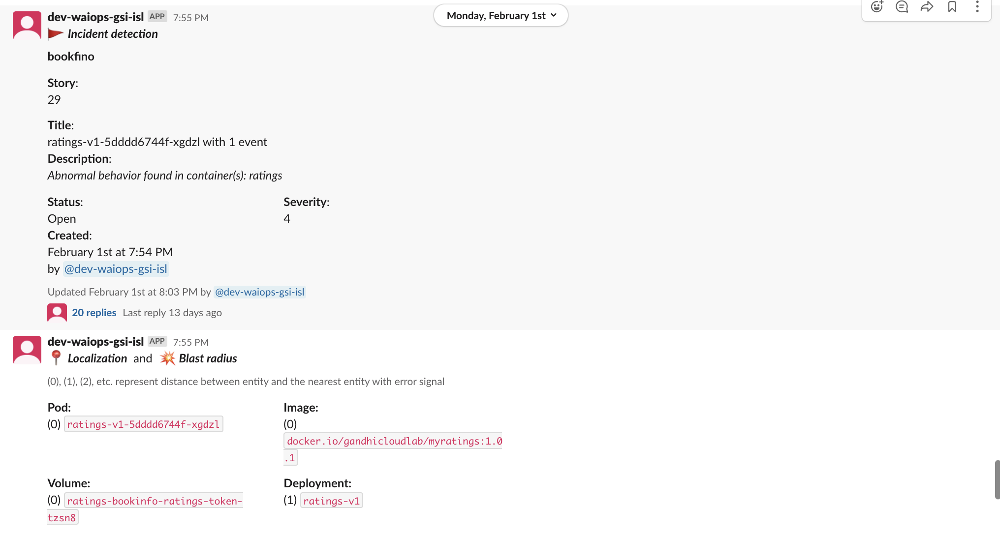
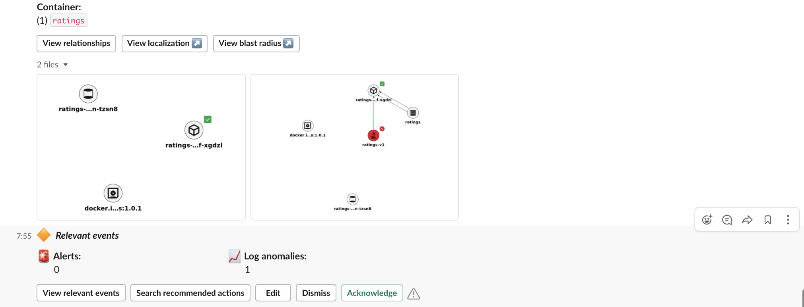

# Log Anomaly Detection by AI-Manager in Watson AI-Ops

This article showcase the **Log Anomaly detection capability of AI-Manager in Watson AI-Ops using LogDNA and BookInfo app**.

The article is based on the the following

- RedHat OpenShift 4.5 on IBM Cloud (ROKS)
- Watson AI-Ops 2.1

## Overview

Here is the architecture and flow of  Watson AI-Ops.


Note: Humio is used in the architecture. But you can use LogDNA as well.

Here is the overall steps to be done for Log Anomaly detection. As part of this article, we will do the checked steps. 

- [ ] 1. Integrate Slack at AI-Manager Instance level
- [ ] 2. Create Application Group
- [ ] 3. Integrate ASM at App Group level
- [ ] 4. Create Application (bookinfo)
- [ ] 5. Train Log Anomaly Models (LogDNA)
- [ ] 6. Integrate LogDNA at app level
- [x] 7. Introduce Log Anomaly at BookInfo app
- [x] 8. View new Incident in a slack story


Here is the picture about it.


## 1. Install BookInfo app in Kubernetes or Openshift

Need to Install BookInfo app.

Refer this article : abcd.com

## 2. Create Topology for BookInfo App

Need to create topology for the bookinfo app in the topology manager (ASM). This an optional step.

Refer this article : abcd.com


## 3. LogDNA Configuration

We are going to train and inference logs from LogDNA. 

You need to do the following configurations.

- Create LogDNA Instance
- Install LogDNA Agent

Refer this article : abcd.com

## 4. Generate Load on app

We need to generate logs to download and train normal logs in AI-Manager.

The below simple command calls the 20000 times the application with 10 conncurrent requests.

```
ab -n 20000 -c 10 http://1.2.3.4:31002/productpage?u=normal
```

This is using the apache bench to create the load. https://httpd.apache.org/docs/2.4/programs/ab.html

You might have received enough logs in the LogDNA for training now.


## 5. Download Logs from LogDNA

The load is created, logs are pushed to LogDNA. You need to download the logs from LogDNA.

Refer this article : abcd.com

## 6. Configuring AI-Manager

You need to create the following in AI-Manager instance.

- Application Group
- Application called bookinfo
- Slack Integration at AI-Manager instance level
- LogDNA integration at Application level
- ASM Topology Integration at AI-Manager instance level  (Optional)
- NOI-Events (Kafka) Integration at Application level (Optional)

Refer this article : 

https://community.ibm.com/community/user/middleware/blogs/jeya-gandhi-rajan-m1/2021/02/09/configuring-ai-manager-in-watson-ai-ops

## 7. Training Normal Logs

Normal logs downloaded from logDNA to be trained in AI-Manager.

Refer this article : 

https://community.ibm.com/community/user/middleware/blogs/jeya-gandhi-rajan-m1/2021/02/10/training-log-anomaly-models-for-ai-manager


## 8. Log Anomaly detection

You need to Induce an error in the application to create some error in the log. By doing that the error in log would be send to LogDNA. 

The AI-Manager would process the error from the log and create the appropriate slack story.

### Down the Ratings Service

The `Ratings` service in the bookinfo app is called from `ProductPage` service via `Reviews` service

```
ProductPage ---> Reviews ---> Ratings
```

Make the `Ratings` service unavailable by setting the `replica` as 0, by using the below command.

```
kubectl scale --replicas=0 deployment/ratings-v1 -n bookinfo
```

### Run the application

Run the application couple of times by opening the below url in the browser.

```
http://1.2.3.4:31002/productpage
```

The error might have occurred in logs and logs might pushed to LogDNA.

### Slack Story

The error logs received in LogDNA would be processed by AI-Manager and creates slack story.





The SRE would look into this story to understand more about the incident and work on this to solve the issue.


## Conclusion

By using trained logs Model, AI-Manager is able to find log anomalies and alert SRE by creating incident as a slack story.

## Note

Instead of using LogDNA here, we can use Humio as well.

## Appendix

#### Training Log anomaly models for AI Manager in Watson AI-Ops

https://community.ibm.com/community/user/middleware/blogs/jeya-gandhi-rajan-m1/2021/02/10/training-log-anomaly-models-for-ai-manager

#### Configuring AI-Manager in Watson AI-Ops

https://community.ibm.com/community/user/middleware/blogs/jeya-gandhi-rajan-m1/2021/02/09/configuring-ai-manager-in-watson-ai-ops


