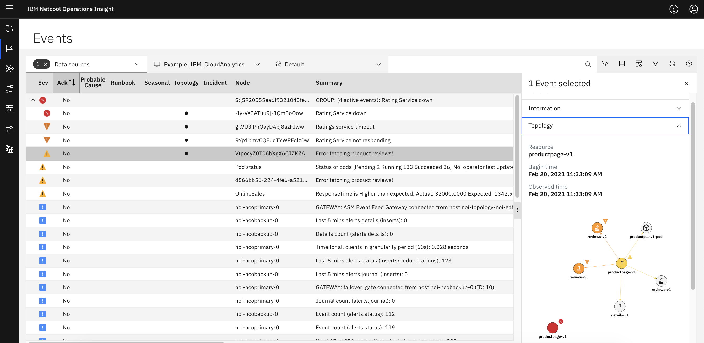

# Event Grouping by AI-Manager in Watson AI-Ops using NOI-Events

This article showcase the Event Grouping capability of AI-Manager in Watson AI-Ops using NOI-Events and BookInfo app.

The article is based on the the following

- RedHat OpenShift 4.5 on IBM Cloud (ROKS)
- Watson AI-Ops 2.1


## Overview

Here is the architecture and flow of Watson AI-Ops.


Note: Humio is used in the architecture. But you can use LogDNA as well.

Here is the overall steps to be done for Event Grouping. As part of this article, we will do the checked steps.

- [ ] 1. Integrate Slack at AI-Manager Instance level
- [ ] 2. Create Application Group
- [ ] 3. Integrate Topology Manager (ASM) at App Group level
- [ ] 4. Create Application (bookinfo)
- [ ] 5. Integrate NOI at app level
- [ ] 6. Train NOI-Events
- [x] 7. Push Events
- [x] 8. View new Incident in a slack story

Here is the picture about overall steps.


## 1. Install BookInfo app in Kubernetes or Openshift

Need to install the BookInfo app.

Refer this article : abcd.com

## 2. Create Topology for BookInfo App

Need to create topology for the bookinfo app in the topology manager (ASM). This an optional step.

Refer this article : abcd.com

## 3. Prepare Sample Event data

The sample data files are available [here](./files/)

#### Sample Event data

The below sample events are available.

```
productpage_down.json
ratings_down.json
reviews-v2_down.json
reviews-v3_down.json
```

#### create-events.sh  

It is a shell script to push sample events to event mangaer. 

## 4. Configuring AI-Manager

You need to create the following in AI-Manager instance.

- Application Group
- Application called bookinfo
- Slack Integration at AI-Manager instance level
- NOI-Events (Kafka) Integration at Application level

- ASM Topology Integration at AI-Manager instance level  (Optional)

Refer this article : 

https://community.ibm.com/community/user/middleware/blogs/jeya-gandhi-rajan-m1/2021/02/09/configuring-ai-manager-in-watson-ai-ops


## 5. Training Events

NOI-Events to be trained.

Refer this article :

https://community.ibm.com/community/user/middleware/blogs/jeya-gandhi-rajan-m1/2021/02/10/training-log-anomaly-models-for-ai-manager


## 6. Event Grouping by AI-Manager

### 6.1 ASM Topology of BookInfo

The current topology of the bookinfo is like this.


### 6.2 Push sample events

a. Change the parameters in the `create-event.sh` file

b. Run the file.

```
sh create-event.sh
```

The sample events are pushed.

### 6.3 ASM Topology of BookInfo

After introducing errors in the `ratings` service the topology become like this.


### 6.4 Events Manager

The events in the event manager looks like this. 4 Events are grouped based on the `scopeid`.


####  Events Actions


####  Temporal Correlation


####  Scope Based Correlation


####  Topology View





### 6.4 Slack Story

Slack story created with the events.


#### Relevant Events

See the releant events are displayed.


