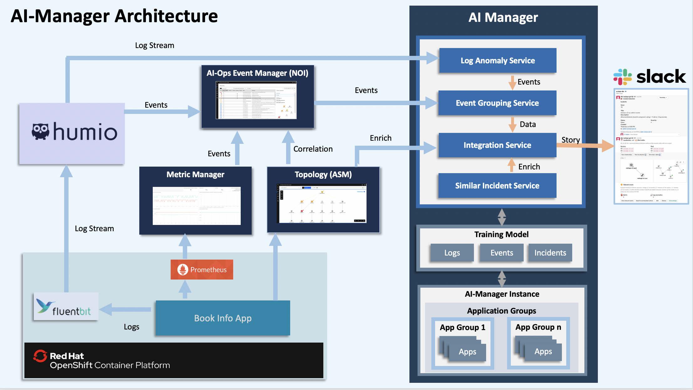
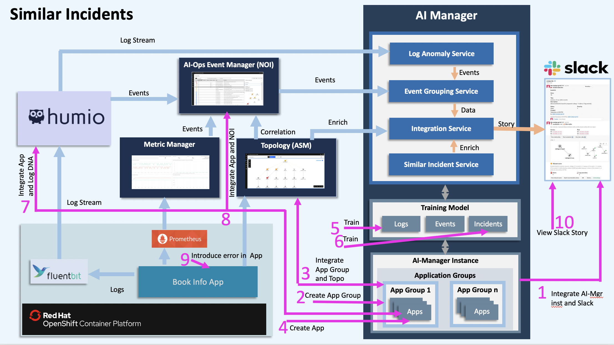
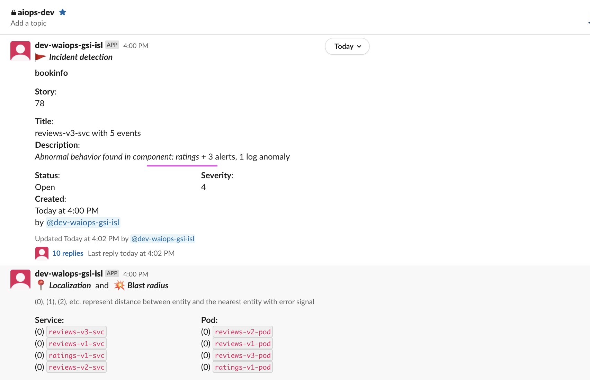
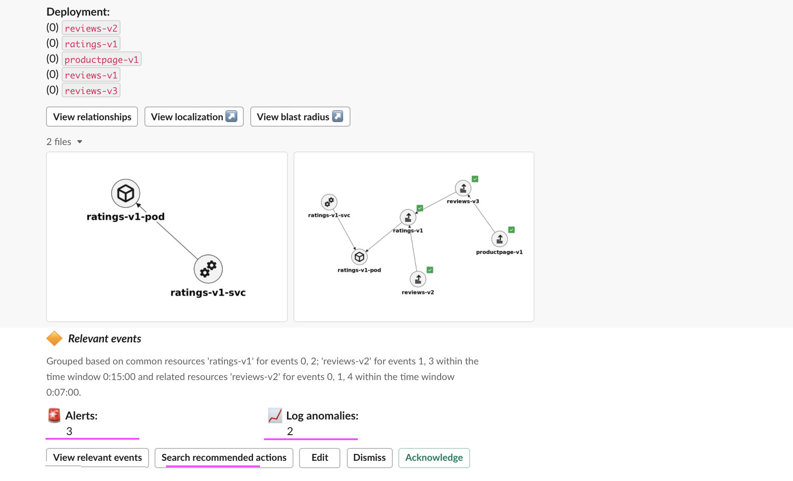
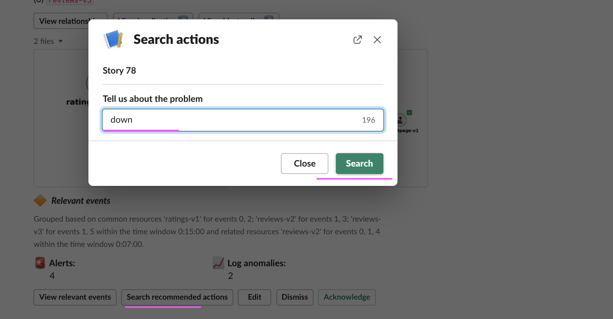
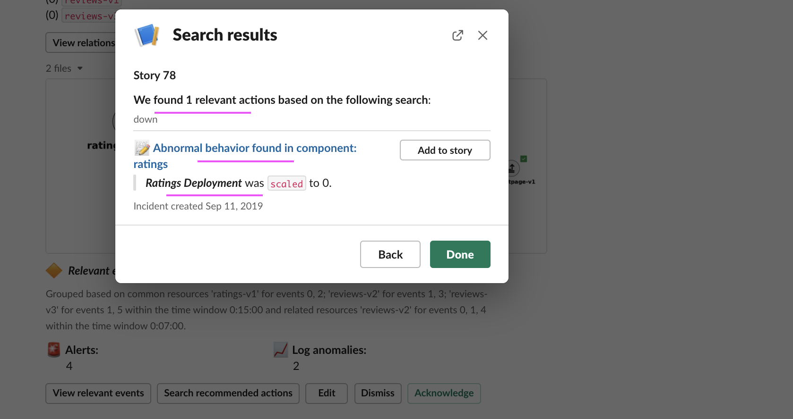

# Similar Incidents by AI-Manager in Watson AI-Ops using NOI-Events

This article showcase the Similar Incidents capability of AI-Manager in Watson AI-Ops using BookInfo app.

The article is based on the the following

- RedHat OpenShift 4.5 on IBM Cloud (ROKS)
- Watson AI-Ops 2.1

## Overview

Here is the architecture and flow of  Watson AI-Ops.

Note: Humio is used in the architecture. But you can use LogDNA as well.

Here is the overall steps to be done for Similar Incidents. As part of this article, we will do the checked steps.

- [ ] 1. Integrate Slack at AI-Manager Instance level
- [ ] 2. Create Application Group
- [ ] 3. Integrate Topology Manager (ASM) at App Group level
- [ ] 4. Create Application (bookinfo)
- [ ] 5. Train Log Anomaly Models (LogDNA)
- [ ] 6. Train Incidents
- [ ] 7. Integrate LogDNA at app level
- [ ] 8. Integrate NOI at app level
- [X] 9. Introduce Log Anomaly at BookInfo app
- [X] 10. View new Incident in a slack story

Here is the picture about it.

## 1. Pre-Requisite Steps

### 1.1 Configuring AI-Manager

You need to create the following in AI-Manager instance.

- Application Group
- Application called bookinfo
- Slack Integration at AI-Manager instance level
- LogDNA integration at Application level

- ASM Topology Integration at AI-Manager instance level  (Optional)
- NOI-Events (Kafka) Integration at Application level (Optional)

Refer this article : 

https://community.ibm.com/community/user/middleware/blogs/jeya-gandhi-rajan-m1/2021/02/09/configuring-ai-manager-in-watson-ai-ops

### 1.2 Training 

The following trainings to be done.

#### 1.2.1 Training Logs

Need to train Normal logs.  

Refer this article : 

https://community.ibm.com/community/user/middleware/blogs/jeya-gandhi-rajan-m1/2021/02/09/configuring-ai-manager-in-watson-ai-ops

#### 1.2.2 Training Events (Optional)

NOI-Events can be trained. This is an optional step.  

Refer this article : abcd.com

#### 1.2.3 Training Similar Incidents

Similar Incidents to be trained. 

Refer this article : abcd.com

### 1.3 Log Anomaly Detection by AI-Manager 

Log Anomaly Detection by AI-Manager to be run to get the slack story for the log anomalies.

Refer this article : 

https://community.ibm.com/community/user/middleware/blogs/jeya-gandhi-rajan-m1/2021/02/14/log-anomaly-detection-by-ai-manager-in-w-ai-ops

## 2. Similar Incidents by AI-Manager

### Slack Story

Based on the Log Anomaly Detection excercise, a slack story is created. 

### Search Recommented Actions

Click on `Search Recommented Actions` button to see whether any incidents related to this already occurs.

Here we search using a string called `down` and got an similar incidents we had before.

