# Topology Observer Job Configuration

This document explains about how to configure an Kubernetes Load observer job, to observe toplogy of an application deployed in a particular namespace of the Openshift.

## Welcome Page

Welcome page of the ASM (Netcool) UI console.

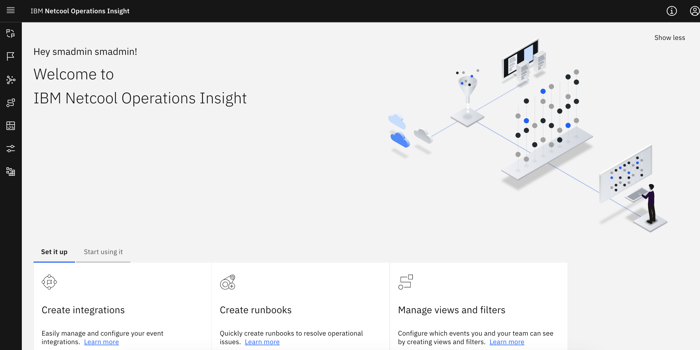

## Toplogy Mangement menu

Click on the Toplogy Mangement menu

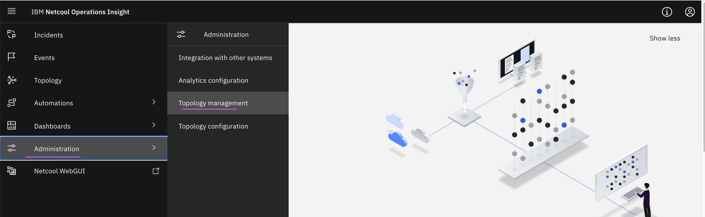

## Topology management Home

Shows Observer Jobs card. Click on the card.

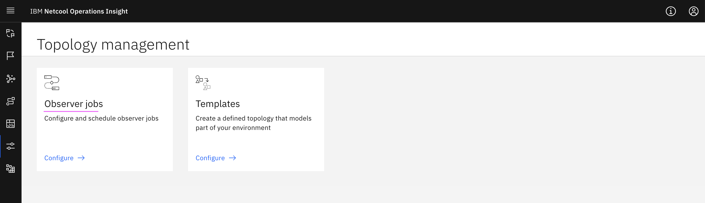

## Observer Jobs List

It shows observer jobs list. 

Click on Add New Jobs to create new observer job. Or Edit existing jobs.

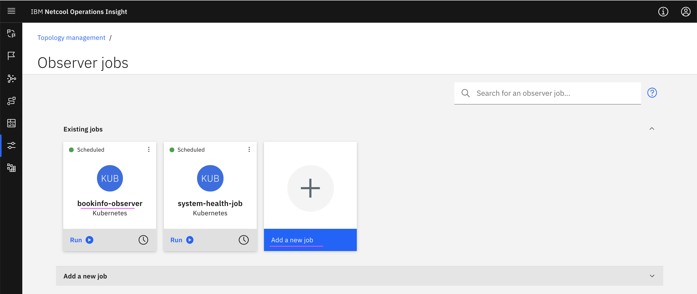

### Add New Jobs

Clicking on Add New Jobs from the above pictures opens the below screen. It shows file observer and kubernetes observer.

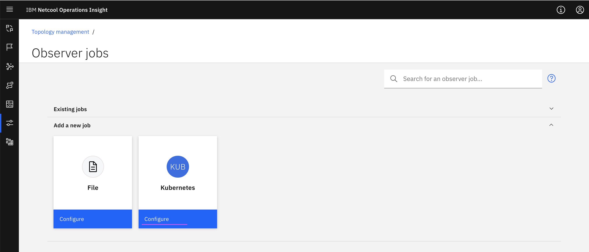

### Edit Jobs

Clicking on existing Jobs to understand the parameters.

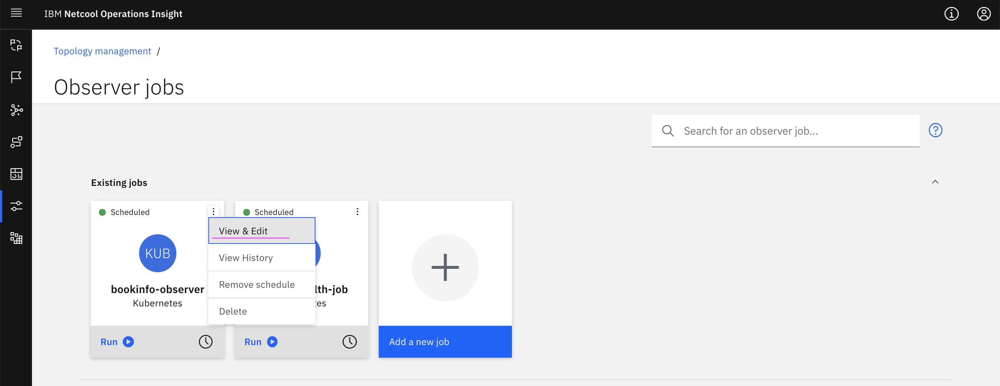
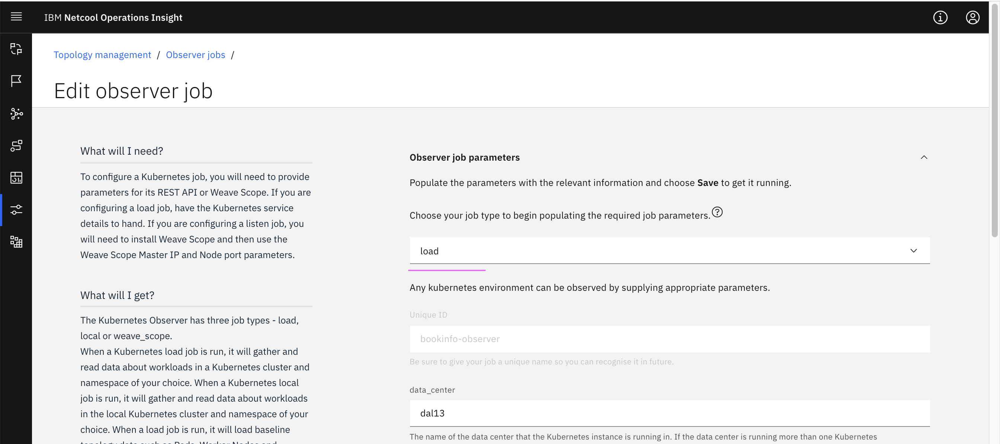
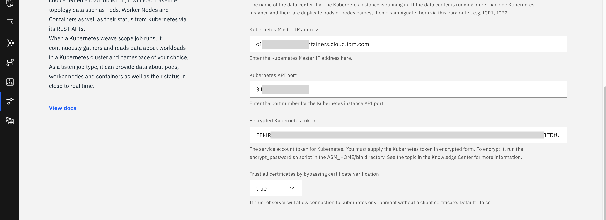
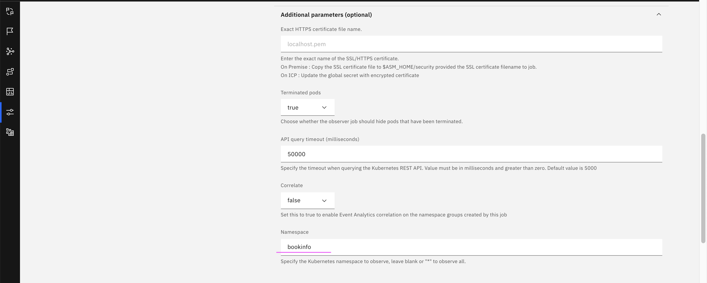
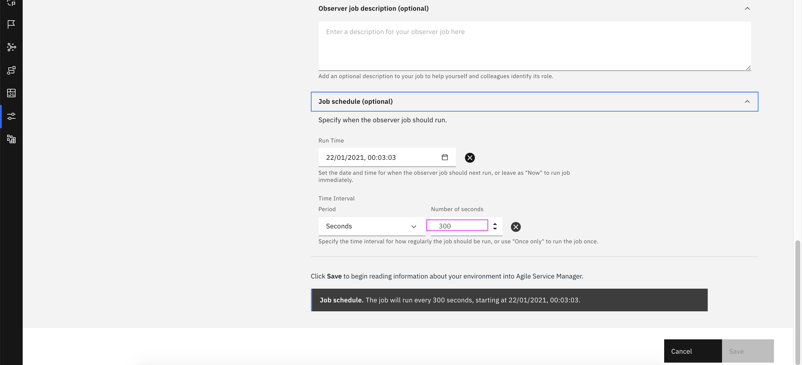

You can get the Encrupted Kubernetes Token by using the document  
[here](../getting-cluster-access-token) . 

## View the Topology

### Select Topology menu

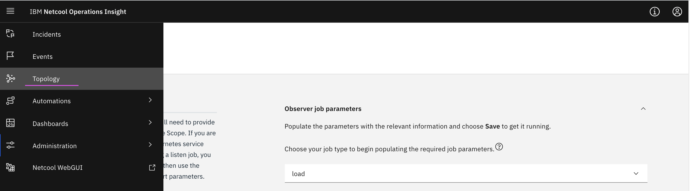

### Search for Product Page

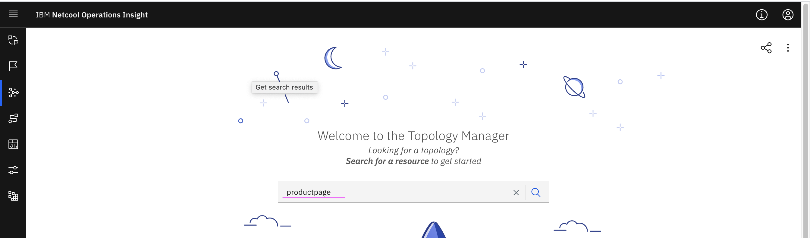

### View Topology

Click on the view Topology to see the toplogy.

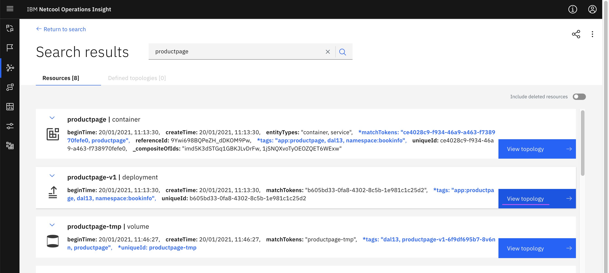

### Topology

Here is the toplogy.

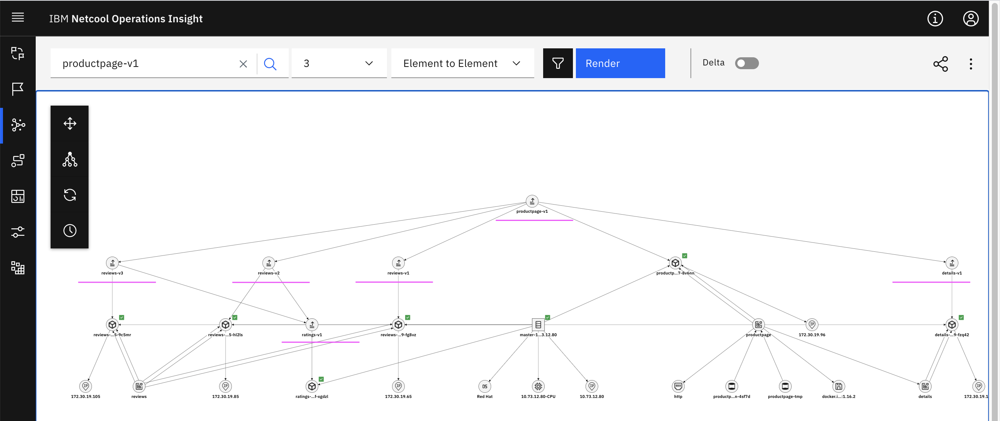
