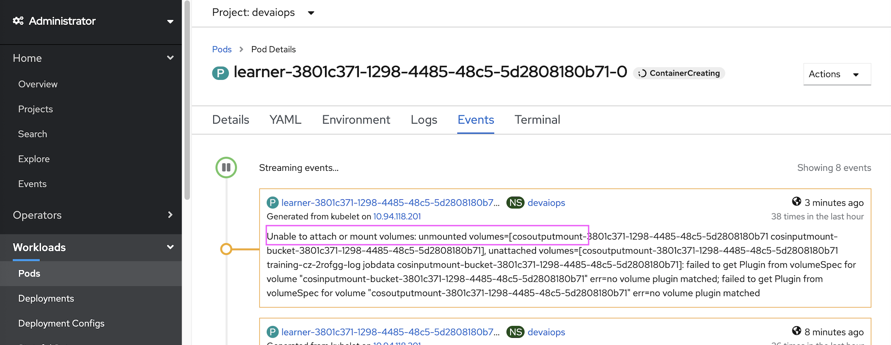
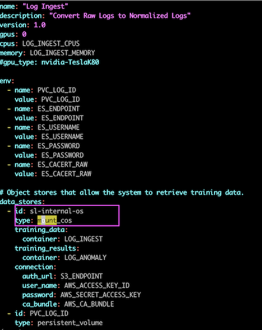
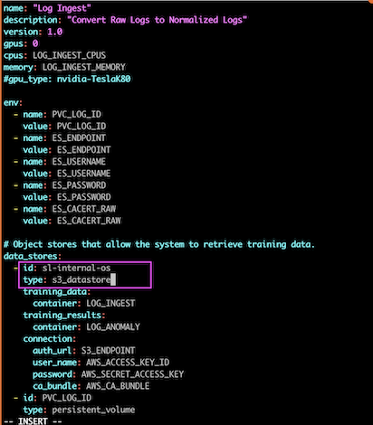

# Update S3-Datastore in Learner POD

This documentation explains about how to modify the `mount_cos` datastore into `s3_datastore` in the training pod.

This update to be done before start the logs/etc training.

You could see the error in the `learner` pod.



## Training POD

Get into the training pod.

```
 oc exec -it $(oc get po |grep model-train-console|awk '{print $1}') bash
```

## Get into the folder

```
cd /home/zeno/train/manifests/s3fs-pvc

ls

```

The output could be like the below.

```
log_ingest.yaml
event_group.yaml
event_ingest.yaml
log_anomaly_eval.yaml
log_ingest_eval.yaml
event_group_eval.yaml
log_anomaly.yaml
```

## Replace the datastore

1. Open the above files one by one

2. Find for text `mount_cos`



3. Replace it with `s3_datastore`




## Command to verify it quickly

```bash
oc exec $(oc get pods -l app.kubernetes.io/component=model-train-console -o jsonpath='{ .items[*].metadata.name }') -- sed -i 's/type: mount_cos/type: s3_datastore/g' /home/zeno/train/manifests/s3fs-pvc/event_group.yaml
oc exec $(oc get pods -l app.kubernetes.io/component=model-train-console -o jsonpath='{ .items[*].metadata.name }') -- sed -i 's/type: mount_cos/type: s3_datastore/g' /home/zeno/train/manifests/s3fs-pvc/event_group_eval.yaml
oc exec $(oc get pods -l app.kubernetes.io/component=model-train-console -o jsonpath='{ .items[*].metadata.name }') -- sed -i 's/type: mount_cos/type: s3_datastore/g' /home/zeno/train/manifests/s3fs-pvc/event_ingest.yaml
oc exec $(oc get pods -l app.kubernetes.io/component=model-train-console -o jsonpath='{ .items[*].metadata.name }') -- sed -i 's/type: mount_cos/type: s3_datastore/g' /home/zeno/train/manifests/s3fs-pvc/log_anomaly.yaml
oc exec $(oc get pods -l app.kubernetes.io/component=model-train-console -o jsonpath='{ .items[*].metadata.name }') -- sed -i 's/type: mount_cos/type: s3_datastore/g' /home/zeno/train/manifests/s3fs-pvc/log_anomaly_eval.yaml
oc exec $(oc get pods -l app.kubernetes.io/component=model-train-console -o jsonpath='{ .items[*].metadata.name }') -- sed -i 's/type: mount_cos/type: s3_datastore/g' /home/zeno/train/manifests/s3fs-pvc/log_ingest.yaml
oc exec $(oc get pods -l app.kubernetes.io/component=model-train-console -o jsonpath='{ .items[*].metadata.name }') -- sed -i 's/type: mount_cos/type: s3_datastore/g' /home/zeno/train/manifests/s3fs-pvc/log_ingest_eval.yaml
```

## Command to verify it quickly

```bash
<user1>$ pwd
/home/zeno/train/manifests/s3fs-pvc
<user1>$ grep -s s3_datastore ./*
./event_group.yaml:    type: s3_datastore
./event_group_eval.yaml:    type: s3_datastore
./event_ingest.yaml:    type: s3_datastore
./log_anomaly.yaml:    type: s3_datastore
./log_anomaly_eval.yaml:    type: s3_datastore
./log_ingest.yaml:    type: s3_datastore
./log_ingest_eval.yaml:    type: s3_datastore
<user1>$ grep -s mount_cos ./*
```