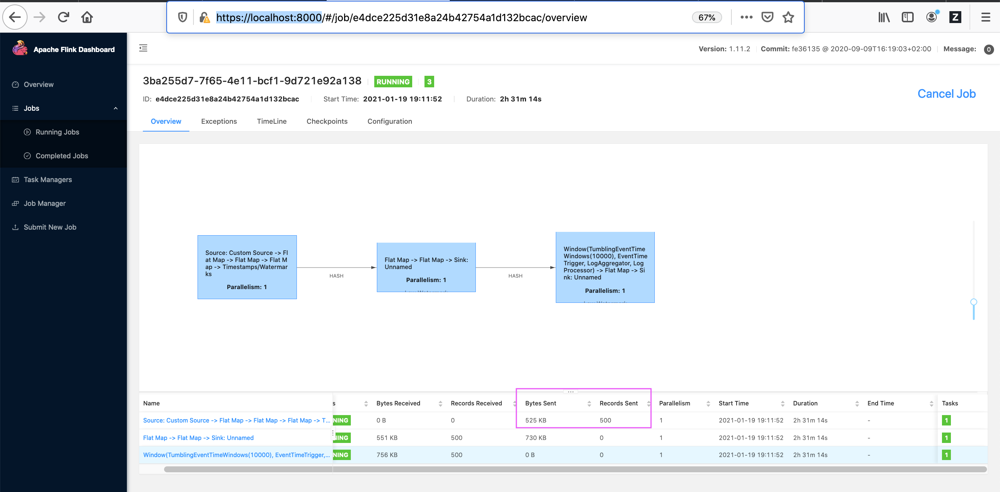

# Flink (Deep Learning as a Service)

Flink helps to see whether the LogDNA data has been sent to AI Manager for inferencing.

## Login to AI Manager installed OCP cluster.

```
oc login --token=YYYYYYYYYYYYYYYYYY --server=https://a111-e.us-south.containers.cloud.ibm.com:11111
```

## Get the flink pods

This command lists all trainings done so far.

```
oc get pods -A | grep flink
```

The output could be like the below.

```
aiops21                                            aimanager-ibm-flink-create-flink-config-secret-72ddt              0/1     Completed   0          20d
aiops21                                            aimanager-ibm-flink-job-manager-0                                 1/1     Running     0          20d
aiops21                                            aimanager-ibm-flink-task-manager-0                                1/1     Running     0          20d

```

Here `aimanager-ibm-flink-job-manager-0` is the flink pod.

## Port forward the flink pod

```
oc port-forward aimanager-ibm-flink-job-manager-0   8000:8000 -n aiops21
```

Note: You need to pass the right namespace where you have installed AI manager.

## Access the flink console in the browser

```
https://localhost:8000
```

## Access the flink console in the browser

Look at the Bytes Sent and Records Sent column values. It should be having some values greater than zero.



