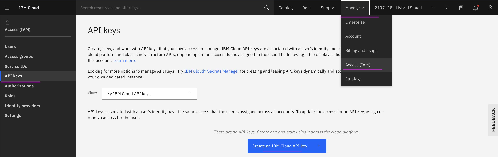
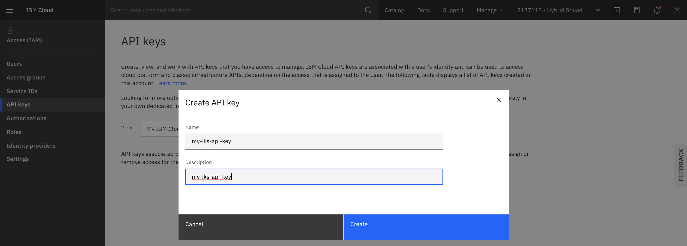
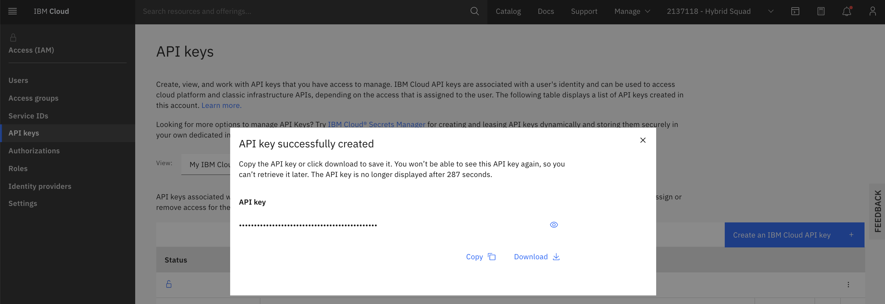
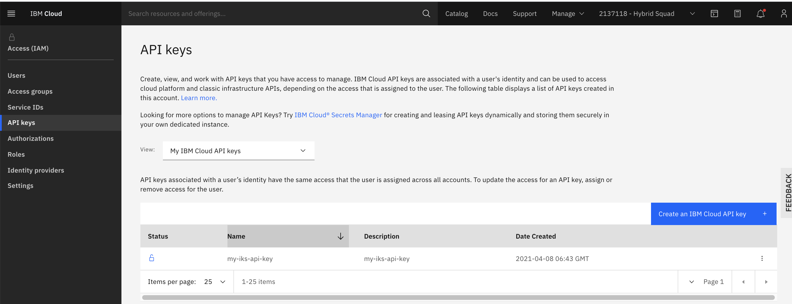

# Accessing IKS Cluster using API Key

Document explains about how to access IKS Cluster using API Key.

## 1. Create IBM Cloud API Key

### 1.1. Login into IBM Cloud

Login into IBM Cloud https://cloud.ibm.com/

### 1.2. Goto API Keys Page

Click on `Manager --> Access (IAM) --> API Keys`

You may see the screen like the below.




### 1.3. Goto Create API Key Page

1. Click on `Create IBM Cloud API Key`

You may see the screen like the below.



2. Enter the `Name` and `Description` for the key

3. Click on `Create`

You may see the screen like the below.



### 1.4. Copy Key

1. Click on `Copy` to copy the key

You may see the created key in the screen like the below.



## 2. Accessing IKS

### 2.1. Login into IBM Cloud 

Login into IBM Cloud using API Key.

Here API_KEY_VALUEEEEEE to be replaced with api-key got from the above section.

```bash
ibmcloud login --apikey API_KEY_VALUEEEEEE
```

### 2.1. Login into IKS

Login into IKS using the commands below.

Replace CLUSTER_ID_VALUEEEEEE with cluster id. ex: abcdefod0125spct9av0
Replace NAMESPACE_VALUEEEEEE with namespace id. ex: bookinfo


```bash
ibmcloud ks cluster config --cluster CLUSTER_ID_VALUEEEEEE
kubectl config current-context
kubectl config set-context --current --namespace=NAMESPACE_VALUEEEEEE
```
