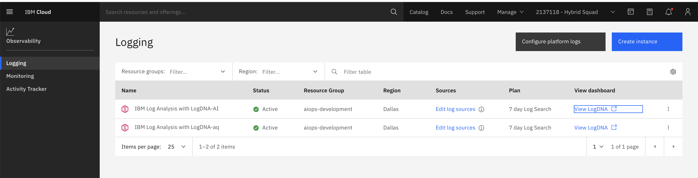
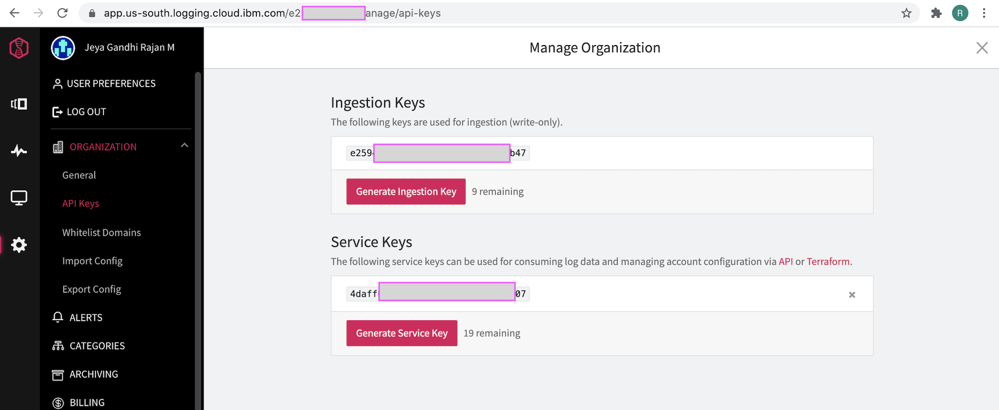
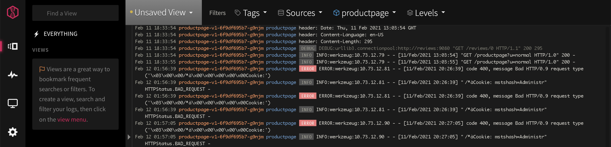
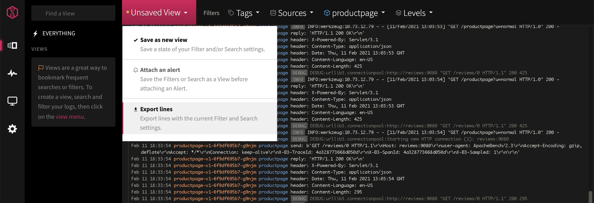
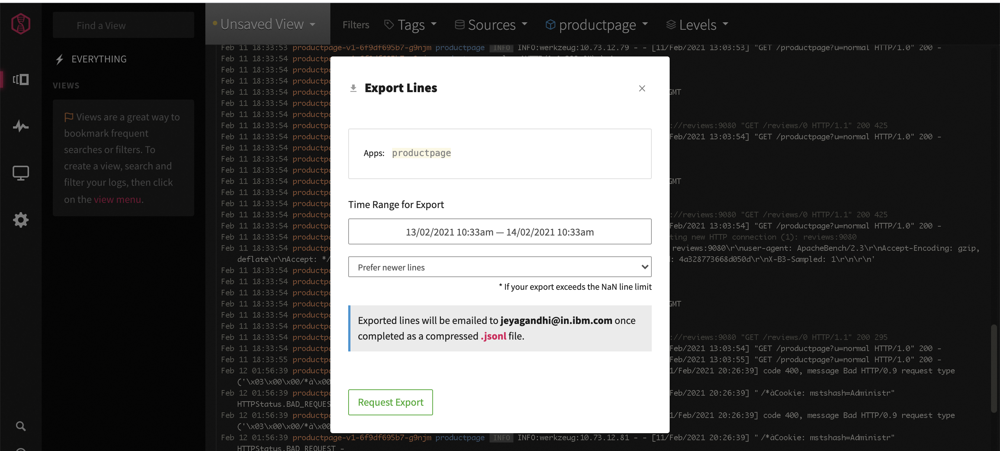

# LogDNA Configuration

This article explains about the following topic in LogDNA Configuration.

- Install LogDNA Instance 
- Install LogDNA agent
- Download Logs from LogDNA

## 1. Create LogDNA Instance 

To persist logs, we are going to use LogDNA here.

Create LogDNA Instance on IBM cloud and note down the Keys. You can find the LogDNA information here.  https://cloud.ibm.com/docs/Log-Analysis-with-LogDNA?topic=Log-Analysis-with-LogDNA-getting-started

Here is sample LogDNA service instances created in IBM Cloud.



#### LogDNA Keys 

The logDNA keys are available here. It will be useful for agents and AI-Manager to connect.




## 2. Install LogDNA Agent

To collect logs from the application that installed on a Cluster, we need to have LogDNA agent installed in the cluster, where the application is installed. We can apply appropriate filter to send only the application logs to LogDNA.

### Connecting a LogDNA agent to an OpenShift cluster

The IBM Cloud documentation is available here. https://cloud.ibm.com/docs/Log-Analysis-with-LogDNA?topic=Log-Analysis-with-LogDNA-config_agent_os_cluster

You need to add exclusion rule to the agent to send only the application (bookinfo) specific logs to the logDNA. So given the install instructions here. 

1. Create a `project`. A project is a namespace in a cluster.

```
oc adm new-project --node-selector='' ibm-observe
```

2. Create the `service account` logdna-agent

```
oc create serviceaccount logdna-agent -n ibm-observe
```

3. Grant the serviceaccount access to the Privileged SCC so the service account has permissions to create priviledged LogDNA pods

```
oc adm policy add-scc-to-user privileged system:serviceaccount:ibm-observe:logdna-agent
```

4. Create a secret to set the ingestion key that the LogDNA agent uses to send logs

```
oc create secret generic logdna-agent-key --from-literal=logdna-agent-key= << LOG_DNA_INGESTION_KEY >> -n ibm-observe
```

5. Download LogDNA Agent yaml manifest

Based on the region where LogDNA is installed, you need to use the appropriate link below. 

Refer the IBM Cloud Documentation https://cloud.ibm.com/docs/Log-Analysis-with-LogDNA?topic=Log-Analysis-with-LogDNA-config_agent_os_cluster#config_agent_os_cluster_step4

We have used link for Dallas (us-south).

```
wget https://assets.us-south.logging.cloud.ibm.com/clients/logdna-agent-ds-os.yaml
```

6. Excluding other logs

We can prevent sending the other logs from the cluster to LogDNA by adding a evironment varilable `LOGDNA_EXCLUDE`.

So add the below line under `env:` in the `DaemonSet` found in the above downloaded yaml. This would stop almost all the other logs to reach LogDNA.

```
- name: LOGDNA_EXCLUDE
  value: "/var/log/cron,/var/log/containers/tigera*,/var/log/containers/prometh*,/var/log/containers/grafa*,/var/log/containers/kiali*,/var/log/containers/jaeger*,/var/log/containers/istio*,/var/log/audit/*,/var/log/crio*,/var/log/messag*,/var/log/containers/*eventstreams*,/var/log/containers/*ibm*,/var/log/containers/*asset*,/var/log/containers/*calico*,/var/log/containers/*ibm*,/var/log/containers/*kube-system*,/var/log/containers/*openshift*,/var/lib/*"
```

You can also include other apps/projects/namespaces in the above line as per your need. For example, if you want to stop an banking related application logs you can add like `/var/log/containers/*banking*`


6. Deploy the yaml

Deploy the agent by running the below command.

```
oc apply -f logdna-agent-ds-os.yaml
```

7. You can see the logs in the LogDNA




### Connecting LogDNA agent to Kubernetes cluster

If you want to connect to Kubernetes cluster, you can follow the IBM Cloud documentation https://cloud.ibm.com/docs/Log-Analysis-with-LogDNA?topic=Log-Analysis-with-LogDNA-config_agent_kube_cluster

To prevent the other logs from the cluster to send to LogDNA by adding a evironment varilable `LOGDNA_EXCLUSION_RULES`.

So add the below line under `env:` in the `DaemonSet` found in the above downloaded yaml. This would stop almost all the other logs to reach LogDNA.

```
    - name: LOGDNA_EXCLUSION_RULES
        value: "/var/log/!(containers)*,/var/log/containers/productpage-*,/var/log/containers/reviews*,/var/log/containers/details*,/var/log/containers/kubernetes-*,/var/log/containers/olm-*,/var/log/containerd*,/var/log/syslog,/var/log/containers/weave*,/var/log/containers/*calico*,/var/log/containers/logdna*,/var/log/containers/dashboard*,/var/log/containers/metrics*,/var/log/containers/ibm*"
```

## 3. Generate Load on app

We need to generate logs to train normal logs in AI-Manager.

The below simple command calls the 20000 times the application with 10 conncurrent requests.

```
ab -n 20000 -c 10 http://1.2.3.4:31002/productpage?u=normal
```

This is using the apache bench to create the load. https://httpd.apache.org/docs/2.4/programs/ab.html

You might have received enough logs in the LogDNA for training.


## 4. Download Logs from LogDNA

### Download from LogDNA UI

You can download logs from the UI. It can export the lines currently filtered and it will sent a link to mail for download. But there is a restriction in size. 

It is better to use scripts to download the logs.





### Download from LogDNA using Script

You can download logs from logdna through scripts.

It is better to use scripts to download the logs. Here is the script to download logs between a time range.

```
curl "https://api.us-south.logging.cloud.ibm.com/v1/export?from=1613239459000&to=1613246659000&size=30000" -u << LOG_DNA_SERVICE_KEY >> > log.txt
```

LOG_DNA_SERVICE_KEY : LogDNA Service Key

1613239459000 : From time InMilliseconds

1613239459000 : To time InMilliseconds

30000 : No. of lines to be downloaded


