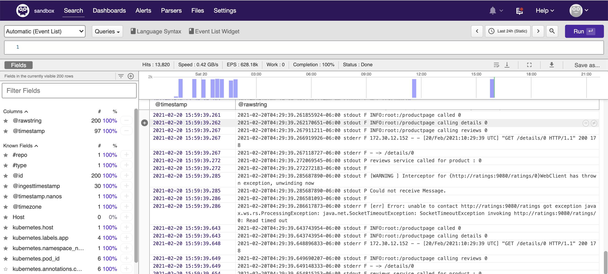
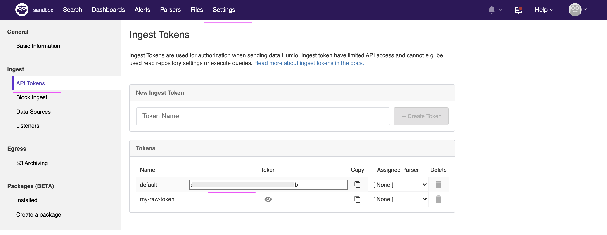
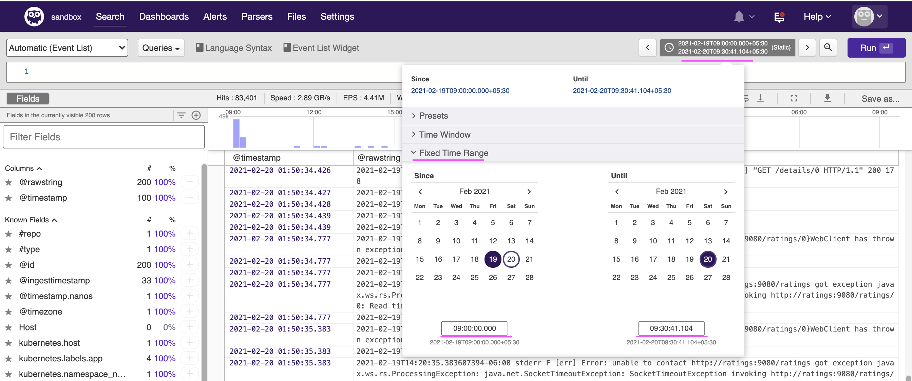
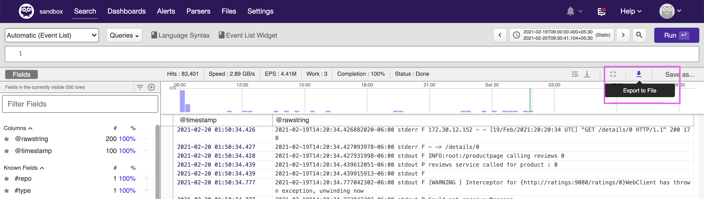
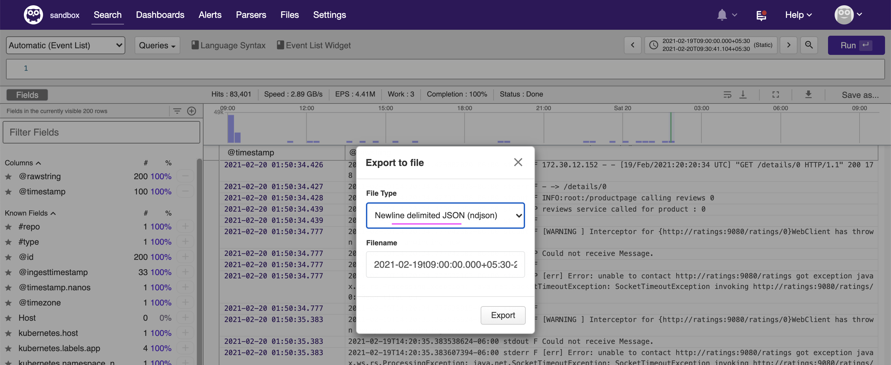

# Humio Configuration

This article explains about the following topic on Humio Configuration.

- Install Humio Instance 
- Install FluentBit agent
- Download Logs from Humio

## 1. Install Humio Instance 

We can install humio as a single node instance using the link  https://docs.humio.com/docs/installation/single-node/humio-install/

#### Humio Dashboard

Dashboard shows current logs



#### Humio Keys 

The Humio keys are available here. It will be useful for agents and AI-Manager to connect.



## 2. Install FluentBit agent

To collect logs from the application that installed on a Cluster, we need to have some agent installed in the cluster, where the application is installed. We can apply appropriate filter to send only the application logs to Humio.

We can use FluentBit as an agent here. 

Refer Appendix for install instructions.

Since we use bookinfo app, you can apply filter to bookinfo only.

## 3. Generate Load on app

We need to generate logs to train normal logs in AI-Manager.

The below simple command calls the 50000 times the application with 10 conncurrent requests.

```
ab -n 50000 -c 10 http://1.2.3.4:31002/productpage?u=normal
```

This is using the apache bench to create the load. https://httpd.apache.org/docs/2.4/programs/ab.html

You might have received enough logs in the Humio for training.

## 4. Download Logs from Humio

#### Choose Fixed Time Range for download



#### Click on Explort icon



#### Choose File Type

Choose File Type as `Newline delimited JSON`




Click `Export` to get the files downloaded.


## Appendix 

### Install FluentBit agent

[FluentBit](../fluentbit-configuration).
