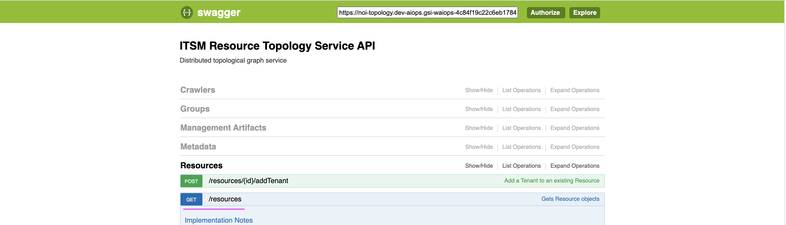
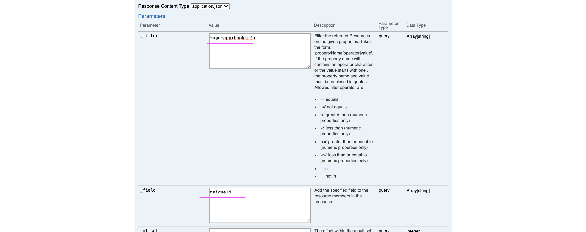
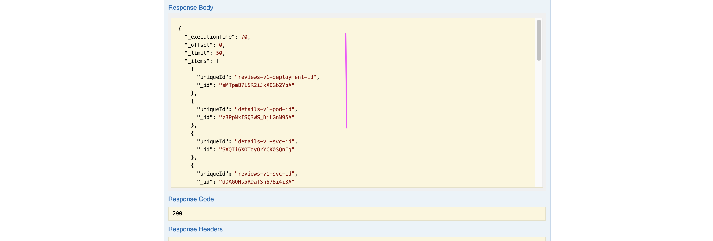

# Topology Creation in Topology Manager

To create topology for bookinfo in the Toplogy Manager follow the steps given.

1. Update the below properties in `00-config.sh`.

```
URL_PREFIX=
NOI_REST_USR=
NOI_REST_PWD=
```

The usr and pwd should be from 


2. Run `01-create-topology-entities.sh`

3. Run the Swagger URL `/resources GET` 

Swager URL

```
https://noi-topology.aiops.aaaa-dal10-bbbb.us-south.containers.appdomain.cloud/1.0/topology/swagger#/
```

_filter	
```    
tags=app:bookinfo
```
   
_field
```    
uniqueId
```

tenentid. This is constant for all.
```    
cfd95b7e-3bc7-4006-a4a8-a73a79c71255
```

The complete curl statement would be 

```
    curl -X GET --header 'Accept: application/json' --header 'X-TenantID: cfd95b7e-3bc7-4006-a4a8-a73a79c71255' 'https://noi-topology.aiops.dal10-bbbb.us-south.containers.appdomain.cloud/1.0/topology/resources?_filter=tags%3Dapp%3Abookinfo&_field=uniqueId&_include_global_resources=false&_include_count=false&_include_status=false&_include_status_severity=false&_include_metadata=false&_return_composites=false'

```





4. A json file format response would be generated. Copy the content into to 01-ids.json



5. Run `02-create-links-matchtoken.sh`

6. Topology might have been created.

### Appendix

The swagger URL password is taken from the secret `topology-asm-credentials`

